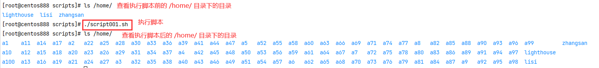

# script001
## 题目

在 `/home` 目录中创建一百个目录，目录名依次为 `a1,a2,...,a100`。


## 分析

本题考查的知识点：
- `while` 循环
- 自定义函数
- `local` 声明局部变量
- 字符串拼接
- `mkdir` 命令

思路：
- 首先从 1 循环到 100，根据前缀（如 `a`）和数字拼接目录名。
- 然后再将 `/home/` 与目录名拼接得到待创建目录的详细路径。
- 最后根据路径创建对应的目录。
- 循环 100 次，就会创建 100 个目录。


## 脚本

```shell
#!/bin/bash

# 定义变量
# 目标目录
DEST_DIR="/home"
# 目录名前缀
DIR_PREFIX="a"

##
# 批量创建目录，如 /home/a1、/home/a2、/home/a3 等
##
function create_directory_batch() {
    # 从 1 循环到 100
    local i=1
    # 即 while(i<=100)
    while [ $i -le 100 ]; do
        # 循环体内的操作，即创建目录
        # 目录名，拼接前缀和数字，如 a1、a100 等
        local DIR_NAME="$DIR_PREFIX$i"
        # 根据目录路径和目录名创建目录
        mkdir "$DEST_DIR/$DIR_NAME"
        # 相当于 i++
        i=$[$i+1]
    done
}

##
# 主函数
##
function main() {
  # 调用批量创建目录的函数
  create_directory_batch
}

# 调用主函数
main
```


## 测试

直接调用脚本即可，不需要传递任何参数。

```bash
./script001.sh
```



