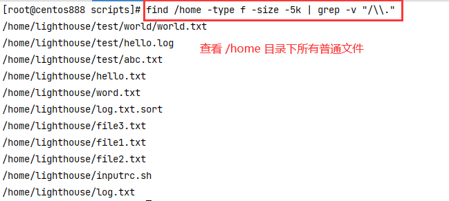
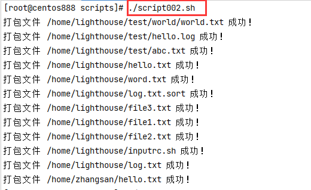
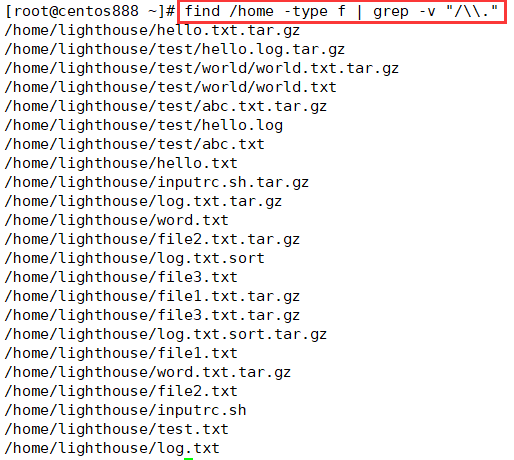

# script002
## 题目

编写一个脚本，自动将用户主目录下所有小于 5KB 的普通文件打包成 `xx.tar.gz`。


## 分析

本题考查的知识点：

- 自定义函数
- 变量与局部变量
- `find` 命令
- 命令替换
- `grep` 命令
- `for` 循环
- 多分支条件语句
- `tar` 命令

思路：

- 通过 `find` 命令找到 `/home` 目录下所有小于 5kb 的普通文件。
- 利用 `grep` 命令排除掉隐藏文件和压缩包文件。
- 然后通过 `for` 循环找到的所有普通文件，一一对它们进行压缩打包。


## 脚本

```shell
#!/bin/bash

# 创建变量
# 目标目录
DEST_HOME="/home"
# 设定目标大小，表示小于 5kb
DEST_SIZE="-5k"

##
# 打包指定目录下指定大小的文件
##
function package_file() {
    # 获取指定目录下指定大小的所有普通文件，注意排除隐藏文件和已经打包过的文件
    # 如果打包文件已经存在，则不要再继续打包了，不然会出现 .tar.gz、.tar.gz.tar.gz、.tar.gz.tar.gz.tar.gz 这样的包
    # find "$DEST_HOME" -type f -size $DEST_SIZE 表示查找所有小于 5kb 的普通文件
    # grep -v "/\\." 表示排除掉隐藏文件
    # grep -v ".tar.gz" 表示排除掉已经是压缩包的文件
    local dest_files=$(find "$DEST_HOME" -type f -size $DEST_SIZE | grep -v "/\\." | grep -v ".tar.gz")
    # 循环遍历这些普通文件，将其进行打包
    for file in $dest_files ; do
        # 拼接打包后的文件路径
        local tar_path="$file.tar.gz"
        # 所以对压缩包路径表示的文件判断是否存在，如果存在则打印提示信息，否则则进行打包
        if [ -e "$tar_path" ]; then
          echo "文件 $tar_path 已经存在！"
        else
          # 进行压缩打包
          # 注意，不加 -v 选项是为了不打印命令执行信息，只打印我们自己的日志；加上 -P 选项是因为我们要以绝对路径表示的文件来进行压缩
          tar -zcPf "$tar_path" "$file"
          echo "打包文件 $file 成功！"
        fi
    done
}

##
# 主函数
##
function main() {
  package_file
}

# 调用主函数
main
```


## 测试

查找 `/home` 目录下所有的普通文件如下：



执行脚本打印的日志：



执行脚本后，打包后再查找结果如下：

