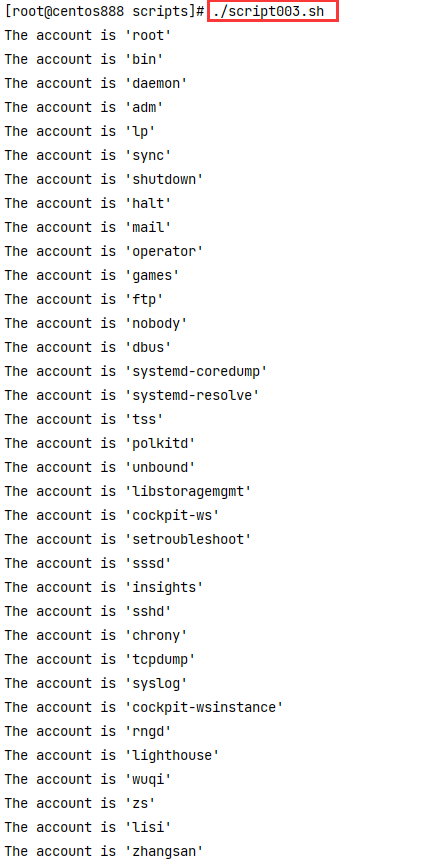

# script003
## 题目

写一个脚本，可以将 `/etc/passwd` 文件的第一列取出，并且每列都以一行字符串 `"The account is 'root'"` 显示。


## 分析

本题考查的知识点：

- `cut` 命令
- 自定义函数
- 局部变量
- 命令替换
- `for...in` 循环

思路：

- 通过 `cut` 命令获取到 `/etc/passwd` 文件中的第一列。因为 `/etc/passwd` 文件每一列都是通过 `:` 字符进行分隔的，所以可以用 `cut` 命令切割出来，获取到所有包含用户名的行。
- 然后遍历所有的用户名，拼接字符串输出即可。


> 注：使用 `cut` 命令只是提取 `/etc/passwd` 文件第一列的一种方式而已，还可以通过 `awk`等其他命令完成。


## 脚本

```shell
#!/bin/bash

##
# 展示用户名
##
function show_username() {
  # 取出 /etc/passwd 文件的第一列
  local usernames=$(cut -d ":" -f 1 "/etc/passwd")
  # 循环遍历所有用户名，拼接字符串进行显示
  for username in $usernames ; do
      echo "The account is '$username'"
  done
}

##
# 主函数
##
function main() {
  show_username
}

# 调用主函数
main
```


## 测试

执行 `./script003.sh` 即可执行脚本。



