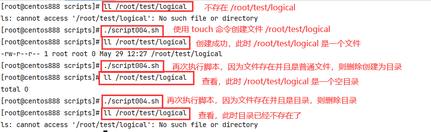

# script004
## 题目

编写一个程序，先查看 `/root/test/logical` 这个名称是否存在，如果不存在，则创建一个文件。使用 `touch` 来创建，创建完成后离开；如果存在的话，判断该名称是否为文件，若为文件则将之删除后创建一个名为 `logical` 的目录，然后离开；如果存在并且该名称为目录，则删除该目录，然后离开。


## 分析

本题考查的知识点：

- 自定义函数
- 变量
- 多条件分支 `if` 判断语句
- 对文件存在的判断、普通文件或目录的判断
- `rm` 命令
- `mkdir` 命令
- `touch` 命令

思路：

- 先判断文件是否存在，如果文件存在则进行下一步。
  - 在文件存在的基础上，如果该文件是普通文件，则删除这个文件，然后创建同名目录。
  - 在文件存在的基础上，如果该文件是目录，则删除这个目录。
- 如果文件不存在，则使用 `touch` 命令进行创建。


## 脚本

```shell
#!/bin/bash

# 声明变量
# 待判断查看的指定路径名称
DEST_PATH="/root/test/logical"

##
# 检查路径
##
function check_path() {
  # 判断文件是否存在，如果存在则继续下一步
  if [ -e "$DEST_PATH" ]; then
      # 如果文件存在并且是一个普通文件
      if [ -f "$DEST_PATH" ]; then
        # 则先删除这个文件
        rm -rf "$DEST_PATH"
        # 再创建一个同名目录出来
        mkdir -p "$DEST_PATH"
      # 如果文件存在并且是一个目录
      elif [ -d "$DEST_PATH" ]; then
        # 则删除这个目录
        rm -rf "$DEST_PATH"
      fi
  # 如果文件不存在，则使用 touch 命令创建文件
  else
      touch "$DEST_PATH"
  fi
}

##
# 主函数
##
function main() {
  check_path
}

# 调用主函数
main
```


## 测试

执行 `./script004.sh` 脚本进行测试：



