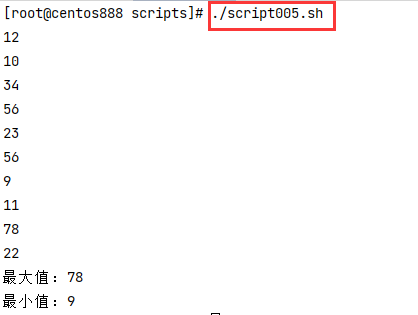

# script005
## 题目

编写一个脚本，从键盘读入 10 个数，显示最大值和最小值。


## 分析

本题考查的知识点：

- 自定义函数
- 局部变量
- 从键盘读入数据 `read` 命令
- `for` 循环
- `if` 多分支条件语句
- 计算最大值和最小值

思路：

- 声明两个变量 `max` 和 `min` 用来记录最大值和最小值。
- 循环遍历 10 次，每次从键盘读入一个数 `num`。
- 如果当前的循环变量 `i` 为 0，则将 `max` 和 `min` 都置为 `num`。
- 如果当前的循环变量 `i` 不为 0，则比较最大值和最小值。
  - 如果 `num` 比 `min` 还要小，则将 `min` 赋值为 `num`。
  - 如果 `num` 比 `max` 还要大，则将 `max` 赋值为 `num`。


> 注：通常在其他编程语言中是求一个数组 `nums` 的最大值或最小值，所以初始是将 `nums[0]` 赋值给 `max` 和 `min`。但在循环输入中，就需要把第一次输入的数赋值给 `min` 和 `max`，所以才需要判断 `i` 是否等于 0 还是不等于 0 进行不同的处理。


## 脚本

```shell
#!/bin/bash

##
# 显示最大值和最小值
##
function show_max_and_min() {
  # 局部变量，分别记录最大数和最小数
  local max
  local min
  # 循环输入 10 个数
  for (( i = 0; i < 10; i++ )); do
      # 从键盘读入一个数，存储到变量 num 中
      read num
      # 如果 i 等于 0 则初始 max 和 min 为第一个数
      if [ $i -eq 0 ]; then
        # 将 max 和 min 都初始为读入的 num
        min=$num
        max=$num
      # 如果 i 不等于 0，则将当前读入的数与最大值 max 和最小值 min 进行比较
      else
        # 如果当前 num 小于 min，那么就将 num 赋值给 min
        if [ $num -lt $min ]; then
            min=$num
        fi
        # 如果当前 num 大于 max，那么就将 num 赋值给 max
        if [ $num -gt $max ]; then
            max=$num
        fi
      fi
  done

  # 最后打印最大值和最小值
  echo "最大值：$max"
  echo "最小值：$min"
}

##
# 主函数
##
function main() {
  # 在主函数中调用
  show_max_and_min
}

# 调用主函数
main
```


## 测试

执行 `./script005.sh` 脚本，输入 10 个数结果如下：



