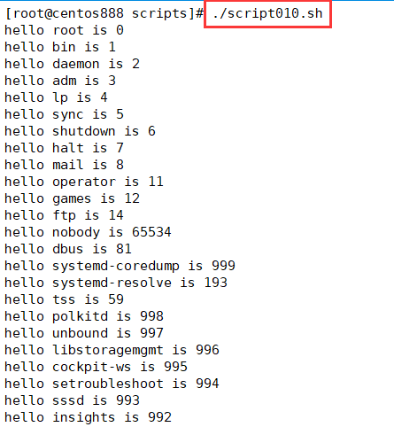

# script010 
## 题目

依次向 `/etc/passwd` 文件中的每个用户问好，并且输出对方的 ID。如下格式：
```text
hello root is 0
hello bin is 1
```


## 分析

本题考查的知识点：

- 自定义函数
- 变量和局部变量
- `cut` 命令
- `for...in` 循环语句
- `echo` 命令

思路：

- 在 `/etc/passwd` 文件中第一列和第三列分别表示用户名和用户 ID，因为每一行中各列是通过冒号 `:` 进行分隔的。所以可以通过 `cut` 命令进行获取。当然还可以使用 `awk` 命令进行提取。
- 接着循环遍历所有提取后的用户信息（每行只包括用户名和用户 ID，通过冒号 `:` 进行分隔），再通过 `cut` 命令分别提取用户名和用户 ID。
- 最后打印它们的信息。


## 脚本

```shell
#!/bin/bash

####################################
#
# 功能：依次向 /etc/passwd 文件中的每个用户问好，并且输出对方的 ID。
#
# 使用：直接执行，无须任何参数。
#
####################################

##
# 依次向 /etc/passwd 文件中的每个用户问好，并且输出对方的 ID
##
function say_hello() {
  # 提取 /etc/passwd 文件中的每个用户
  local users
  users=$(cut -d ":" -f 1,3 "/etc/passwd")
  # 循环遍历所有的用户，向它们问好
  for user in $users ; do
      # 提取用户名
      local username
      username=$(echo "$user" | cut -d ":" -f 1)
      # 提取用户id
      local userid
      userid=$(echo "$user" | cut -d ":" -f 2)
      # 打印结果
      echo "hello $username is $userid"
  done
}

##
# 主函数
##
function main() {
  # 在主函数中调用
  say_hello
}

# 调用主函数
main
```


## 测试

执行 `./script010.sh` 启动脚本：



