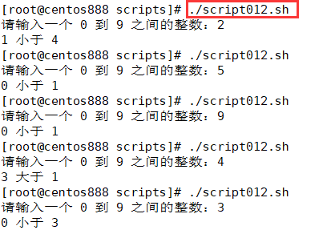

# script012 
## 题目

要求生成一个 0~9 的随机整数 num1，另外从键盘输入一个 0~9 的整数 num2，使用 num1 与 num2 进行取余和整除操作，并且比较取余和整除结果的大小。


## 分析

本题考查的知识点：

- 自定义函数
- 局部变量
- `$RANDOM` 获取随机数
- `read` 命令
- `$[]` 数学运算
- 比较数字大小

思路：

- 生成一个 `[0, 9]` 范围内的随机数 `num1`。这里是通过 `$RANDOM%10` 来获取的随机数，其中 `$RANDOM` 可以获取一个随机数。
- 通过`read` 命令从键盘输入一个随机数 `num2`。需要注意校验输入参数。
- 求 `num1` 和 `num2` 的取余和整除结果。
- 然后比较取余和整除结果的大小，输出对应的提示信息。


## 脚本

```shell
#!/bin/bash

####################################
#
# 功能：要求生成一个 0-9 的随机整数 num1，另外从键盘输入一个 0-9 的整数 num2，使用 num1 与 num2 进行取余和整除操作，并且比较取余和整除结果的大小。
#
# 使用：直接执行，无须任何参数。
#
####################################

##
# 比较大小
##
function compare_random_num() {
  # 生成随机整数 num1
  local num1=$[$RANDOM%10]
  # 从键盘读入一个整数
  read -p "请输入一个 0 到 9 之间的整数：" num2

  # 求 num1 与 num2 的取余结果
  local r1=$[$num1%$num2]
  # 求 num1 与 num2 的整除结果
  local r2=$[$num1/$num2]

  # 比较 r1 和 r2 的大小
  if [ $r1 -gt $r2 ]; then
      echo "$r1 大于 $r2"
  elif [ $r1 -lt $r2 ]; then
      echo "$r1 小于 $r2"
  else
      echo "$r1 等于 $r2"
  fi
}

##
# 主函数
##
function main() {
  # 在主函数中调用
  compare_random_num
}

# 调用主函数
main
```


## 测试

执行 `./script012.sh` 启动脚本。然后输入一个 `[0, 9]` 范围内的整数，结果如下：



