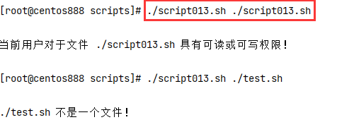

# script013 
## 题目

判断当前用户对指定参数文件，是否不可读并且不可写。


## 分析

本题考查的知识点：

- 自定义函数
- 局部变量
- 判断文件
- `cut` 命令

思路：

- 脚本一：读取 `ls -l` 所表示的文件的权限，然后提取字符串判断该文件是否具有读写权限。例如 `-rwxr-xr-x` 如果第二个字符是 `r` 表示具有读权限；第三个字符是 `w` 表示具有写权限。
- 脚本二：使用 `-r` 和 `-w` 选项来判断是否具有文件的读写权限。


> 注：如果当前用户是超级用户，将文件的权限修改为 `000`，那么脚本一会判断当前用户不具有读写权限，但是脚本二会判断当前超级用户具有读写权限，事实上超级用户也确实仍然具有读写权限。


## 脚本一

```shell
#!/bin/bash

####################################
#
# 功能：判断当前用户对指定参数文件，是否不可读并且不可写。
#
# 使用：需要输入一个一个文件路径作为参数
#
####################################

##
# 检查文件权限
##
function check() {
    # 参数校验
    if [ $# -ne 1 ]; then
        echo "请输入一个参数！"
        exit
    fi

    # 获取传入的第一个参数，即文件
    local file="$1"
    # 判断是否存在并且是文件
    if [ -f "$file" ]; then
      # 获取文件的权限，即 `ls -l` 命令的第一行的 `-rwxr-xr-x`
      local perm
      perm=$(ls -l "$file" | cut -d " " -f 1)
      # 获取可读权限，即 `-rwxr-xr-x` 是第二个字符表示用户的读权限字符
      local read
      read=$(echo "$perm" | cut -c 2)
      # 获取可写权限，即 `-rwxr-xr-x` 是第三个字符表示用户的写权限字符
      local write
      write=$(echo "$perm" | cut -c 3)

      # 判断该用户是否具有可读和可写权限，`-a` 选项表示与的关系，需要条件同时满足
      if [ "$read" != "r" -a "$write" != "w" ]; then
          echo
          echo "当前用户对于文件 $file 具有不可读并且不可写权限！"
          echo
          exit
      # 如果文件不同时具有读写权限，则给出提示信息
      else
        echo
        echo "当前用户对于文件 $file 具有可读或可写权限！"
        echo
        exit
      fi
    # 如果不存在或者不是一个文件则给出提示，退出程序
    else
      echo
      echo "$file 不是一个文件！"
      echo
      exit
    fi
}

##
# 主函数
##
function main() {
    # 在主函数中调用
    check "$1"
}

# 调用主函数
main "$1"
```


## 脚本二

```shell
#!/bin/bash

####################################
#
# 功能：判断当前用户对指定参数文件，是否不可读并且不可写。
#
# 使用：需要输入一个一个文件路径作为参数
#
####################################

##
# 检查文件权限
##
function check() {
    # 参数校验
    if [ $# -ne 1 ]; then
        echo "请输入一个参数！"
        exit
    fi

    # 获取传入的第一个参数，即文件
    local file="$1"
    # 判断是否存在并且是文件
    if [ -f "$file" ]; then
      # 使用 -r 选项来判断文件是否具有可读权限；使用 -w 选项来判断文件是否具有可写权限
      if [ ! -r "$file" ] && [ ! -w "$file" ]; then
          echo
          echo "当前用户对于文件 $file 具有不可读并且不可写权限！"
          echo
          exit
      # 如果文件不同时具有读写权限，则给出提示信息
      else
          echo
          echo "当前用户对于文件 $file 具有可读或可写权限！"
          echo
          exit
      fi
    # 如果不存在或者不是一个文件则给出提示，退出程序
    else
      echo
      echo "$file 不是一个文件！"
      echo
      exit
    fi
}

##
# 主函数
##
function main() {
    # 在主函数中调用
    check "$1"
}

# 调用主函数
main "$1"
```


## 测试

执行 `./script013.sh filepath` 启动脚本，其中 `filepath` 表示文件路径。



