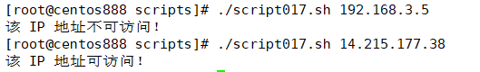

# script017
## 题目

编写脚本 `/root/bin/hostping.sh`，接受一个主机的 IPv4 地址作为参数，测试是否可连通。如果能够 ping 通，则提示用户“该 IP 地址可访问”；如果不能 ping 通，则提示用户“该 IP 地址不可访问”。


## 分析

本题考查的知识点：

- `if...else` 条件判断语句
- 数字比较大小
- `ping` 命令
- `$?` 

思路：

- `ping` 命令可以用来测试 IP 地址是否是可连通。这里判断 IP 地址有效的原理是对执行了 `ping` 命令后的退出码进行判断，如果为 0 表示正确执行，如果不为 0 表示错误执行。


> 注：关于 `$?` 表示最后一次执行的命令的返回状态。如果这个变量的值为 0，证明上一个命令正确执行；如果这个变量的值不为 0，则证明上一个命令执行不正确了。所以可以用来判断 IP 地址是否可以连通。


## 脚本

```shell
#!/bin/bash

####################################
#
# 功能：接受一个主机的 IPv4 地址作为参数，测试是否可连通。如果能够 ping 通，则提示用户“该 IP 地址可访问”；如果不能 ping 通，则提示用户“该 IP 地址不可访问”。
#
# 使用：传递 IPv4 地址作为第一个参数
#
####################################


# 参数校验
if [ "$#" -ne 1 ]; then
    echo "请输入一个参数！"
fi
# 第一个输入的参数是 IPv4 地址
ipv4="$1"
# 注意，这里并没有校验IP地址的合法性
# 测试 IP 是否可连通的原理：如果 IP 有效，则执行 `ping` 命令后的退出码为 0；如果无效，则退出码非 0
# 为了不打印 ping 的执行过程，可以将输出重定向到 /dev/null 中
ping -c 4 "$ipv4" > /dev/null
# 通过 $? 可以得到上一条命令的执行退出码
exit_code=$?
# 判断退出码是否为 0
if [ "$exit_code" -eq 0 ]; then
    echo "该 IP 地址可访问！"
else
    echo "该 IP 地址不可访问！"
fi
```


## 测试

执行 `./script017.sh IP地址` 调用脚本，其中 `IP地址` 是待测试的真实 IP。



