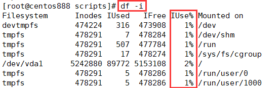
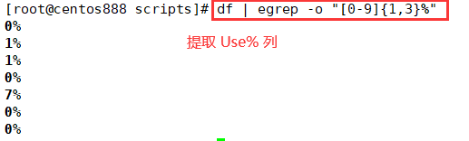
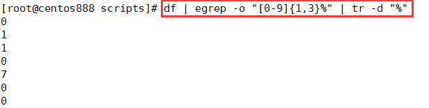
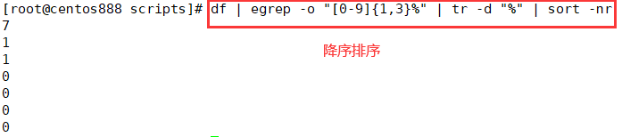
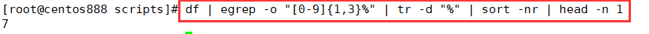

# script018 
## 题目

编写脚本 `/root/bin/checkdisk.sh`，检查磁盘分区空间和 inode 使用率，如果超过 80%，则发广播警告空间将满。


## 分析

本题考查的知识点：

- `df` 命令
- `egrep` 命令
- `tr` 命令
- `sort` 命令
- `head` 命令
- `if` 条件判断语句
- `wall` 命令
- 数字比较大小

思路：

> 即找到磁盘空间或 `inode` 的最大使用率，判断它是否大于 `80%`。

- 使用 `df` 或 `df -i` 查看磁盘空间使用率或 `inode` 使用率，即 `Use%` 和 `IUse%` 列。




- 使用 `egrep -o "[0-9]{1,3}%"` 匹配到 `Use%` 列，并且不要标题行。其中 `"[0-9]{1,3}%"` 用来匹配 `Use%` 列的数值，使用的是正则表达式，表示至少一位最多三位 `[0,9]` 的数字，即 `0%~100%`。



- 使用 `tr -d "%"` 可以去掉百分号 `%`。



- `sort -nr` 可以对数字列进行排序，并且是降序排序。



- 使用 `head -n 1` 可以提取第一行的内容。




## 脚本

```shell
#!/bin/bash

####################################
#
# 功能：检查磁盘分区空间和 inode 使用率，如果超过 80%，则发广播警告空间将满。
#
# 使用：直接调用，不需要任何参数
#
####################################


# 获取磁盘分区空间的使用率
disk_usage=$(df | egrep -o "[0-9]{1,3}%" | tr -d "%" | sort -nr | head -n 1)
# 如果磁盘空间的使用率大于等于 80% 则给出提示
if [ $disk_usage -ge 80 ]; then
    wall "警告！当前磁盘空间的使用率已经超过 80%！"
fi

# 获取 inode 使用率
inode_usage=$(df -i | egrep -o "[0-9]{1,3}%" | tr -d "%" | sort -nr | head -n 1)
# 如果 inode 的使用率大于等于 80% 则给出提示
if [ $inode_usage -ge 80 ]; then
    wall "警告！当前 inode 的使用率已经超过 80%！"
fi
```


## 测试

执行 `./script018.sh` 调用脚本。

