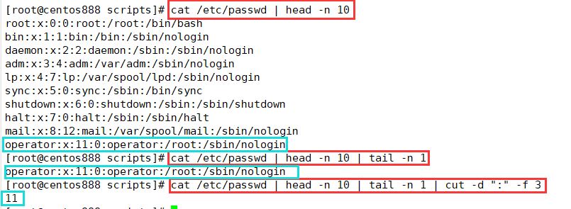
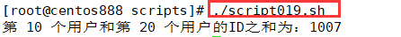

# script019 
## 题目

编写脚本 `/root/bin/sumid.sh` ，计算 `/etc/passwd` 文件中的第 10 个用户和第 20 用户的ID之和


## 分析

本题考查的知识点：

- `/etc/passwd` 文件
- `cat` 命令
- `head` 命令
- `tail` 命令
- `cut` 命令

- `$(())`

思路：

- `cat /etc/passwd` 可以查看 `/etc/passwd` 文件的所有内容。

- `head -n 10` 提取前 10 行的内容。
- `tail -n 1` 提取 10 行中的最后一行内容。
- `cut -d ":" -f 3` 可以提取 `/etc/passwd` 文件第 10 行第 3 个字段的值，每一行通过冒号 `:` 分隔的。而 `cut` 命令可以切割得到第三个字段的值。




## 脚本

```shell
#!/bin/bash

####################################
#
# 功能：计算 /etc/passwd 文件中的第 10 个用户和第 20 个用户的ID之和
#
# 使用：直接调用，不需要任何参数
#
####################################


# 获取第 10 个用户的用户 ID，即 /etc/passwd 文件的第 10 行第 3 个字段（通过冒号分隔）
user_id1=$(cat /etc/passwd | head -n 10 | tail -n 1 | cut -d ":" -f 3)
# 获取第 20 个用户的用户 ID，即 /etc/passwd 文件的第 20 行第 3 个字段（通过冒号分隔）
user_id2=$(cat /etc/passwd | head -n 20 | tail -n 1 | cut -d ":" -f 3)
# 计算两个用户 ID 之和
result=$(($user_id1+$user_id2))
# 打印相加结果
echo "第 10 个用户和第 20 个用户的ID之和为：$result"
```


## 测试

直接执行 `./script019.sh` 调用脚本：



