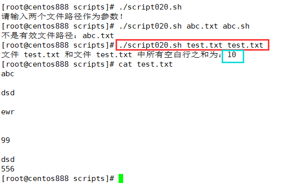

# script020
## 题目

编写脚本 `/root/bin/sumspace.sh`，传递两个文件路径作为参数给脚本，计算这两个文件中所有空白行之和


## 分析

本题考查的知识点：

- `if` 条件判断语句
- 参数 `$1`、`$2`
- 判断文件有效性 `-f`
- `grep` 命令
- `$(())`

思路：

- 即校验参数的个数和文件路径的有效性。
- 然后使用 `grep` 命令获取文件中空白行数，其实是用正则表达式 `"^$"` 去匹配空白行，然后用 `-c` 选项计数。
- 最后用 `$(())` 计算两个文件的空白行数之和。


> 注：本题可参考：[script016.md](https://github.com/lcl100/linux-shell-exercise/blob/main/exercise/script016.md)。


## 脚本

```shell
#!/bin/bash

####################################
#
# 功能：传递两个文件路径作为参数给脚本，计算这两个文件中所有空白行之和
#
# 使用：传递一个文件路径作为第一个参数；传递另外一个文件路径作为第二个参数
#
####################################


# 参数校验，如果参数不够两个则提示
if [ $# -ne 2 ]; then
    echo "请输入两个文件路径作为参数！"
    exit
fi

# 接收传递进来的参数
file_path1="$1"
file_path2="$2"

# 校验文件路径是否真的存在并且是文件，否则给出提示并退出程序
if [ ! -f "$file_path1" ]; then
    echo "不是有效文件路径：$file_path1"
    exit
fi
if [ ! -f "$file_path2" ]; then
    echo "不是有效文件路径：$file_path2"
    exit
fi

# 统计两个文件的空白行数
blank_line_count1=$(grep "^$" -c "$file_path1")
blank_line_count2=$(grep "^$" -c "$file_path2")

# 计算两个文件的空白行之和，并打印结果
result=$(($blank_line_count1+$blank_line_count2))
echo "文件 $file_path1 和文件 $file_path2 中所有空白行之和为：$result"
```


## 测试

执行 `./script020.sh 脚本文件1 脚本文件2` 调用脚本，分别传入两个有效的文件路径作为参数。



