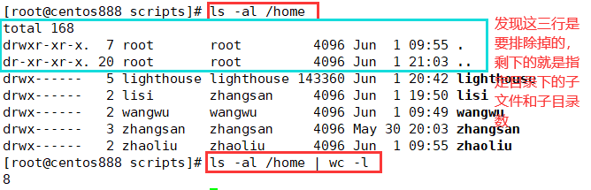
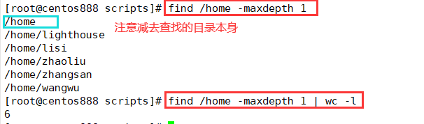
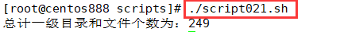

# script021 
## 题目

编写脚本 `/root/bin/sumfile.sh`，统计 `/etc`、`/var`、 `/usr` 目录中共有多少个一级子目录和文件。


## 分析

本题考查的知识点：

- `for...in` 循环语句
- 变量
- `$()`
- `$(())`
- `ls` 命令
- `wc` 命令
- `echo` 命令

思路：

- 本题要统计的目录是 `/etc`、`/var` 和 `/usr`，但这里把它们存入了一个变量 `DEST_DIR` 中，然后通过空格进行分隔，可以使用 `for...in` 进行循环得到每一个路径。
- 通过 `ls -al` 命令可以查找指定目录下的所有文件，包括隐藏文件。而 `wc` 命令用来统计 `ls` 命令查询出来的总行数。
- 注意，如果是 `ls -al` 命令查找的文件列表则要减去 3；如果是使用 `find -maxdepth 1` 查找的文件则需要减去 1。






- 最终计算三个目录下的一级子目录和文件的总和。


## 脚本一

```shell
#!/bin/bash

####################################
#
# 功能：统计 /etc、/var、 /usr 目录中共有多少个一级子目录和文件。
#
# 使用：直接调用，不需要任何参数
#
####################################


# 变量，记录待统计的路径，以逗号进行分隔
DEST_DIR="/etc /var /usr"
# 计数器，记录目录和文件总数
sum=0
# 循环所有路径
for path in $DEST_DIR ; do
  # 统计指定目录下的文件个数
  count=$(ls -al "$path" | wc -l)
  # 减去三行，分别表示 Total、.、..
  count=$(($count-3))
  # 加数计入总和
  sum=$(($count+$sum))
done
# 打印最终结果
echo "总计一级目录和文件个数为：$sum"

```


## 脚本二

```shell
#!/bin/bash

####################################
#
# 功能：统计 /etc、/var、 /usr 目录中共有多少个一级子目录和文件。
#
# 使用：直接调用，不需要任何参数
#
####################################


# 变量，记录待统计的路径，以逗号进行分隔
DEST_DIR="/etc /var /usr"
# 计数器，记录目录和文件总数
sum=0
# 循环所有路径
for path in $DEST_DIR ; do
  # 查找指定目录下的子文件和子目录
  count=$(find "$path" -maxdepth 1 | wc -l)
  # 减去一，是减去了指定目录本身，如 /etc
  count=$(($count-1))
  # 加数计入总和
  sum=$(($count+$sum))
done
# 打印最终结果
echo "总计一级目录和文件个数为：$sum"
```


## 测试

执行 `./script021.sh` 调用脚本：



