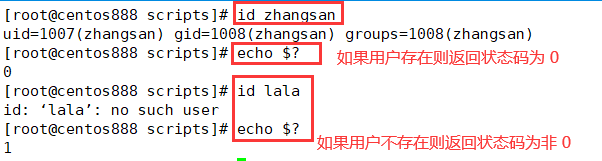

# script022 
## 题目

编写脚本 `/root/bin/createuser.sh`，实现如下功能：使用一个用户名做为参数，如果指定参数的用户存在，就显示其存在，否则添加之；显示添加的用户的 id 号等信息。


## 分析

本题考查的知识点：

- `if...else` 条件判断语句
- `$1`、`$?`  变量
- 数字比较大小
- `id` 命令
- `useradd` 命令
- `echo` 命令

思路：

- 本题的难点在于如何判断用户是否存在，我们可以通过 `id` 命令。如果用户存在则会输出用户的相关信息，并且返回状态码为 `0`；如果用户不存在则会提示用户不存在，并且返回状态码为非 `0`。



- 所以可以根据 `id` 命令执行返回的状态码是否等于 `0` 来判断用户是否存在。而可以通过特殊变量 `$?` 来获取这个返回的状态码。
- 获取到的状态码后，判断它是否等于 `0` 即可。如果等于 `0` 则表示该用户存在则输出提示信息；如果不等于 `0`  则表示该用户不存在，则使用 `useradd` 命令添加新用户，然后使用 `id` 命令显示新增用户的信息。


## 脚本

```shell
#!/bin/bash

####################################
#
# 功能：使用一个用户名做为参数，如果指定参数的用户存在，就显示其存在，否则添加之；显示添加的用户的 id 号等信息。
#
# 使用：传递一个用户名作为第一个参数
#
####################################


# 参数个数校验
if [ $# -ne 1 ]; then
    echo "请输入一个用户名！"
    exit
fi

# 判断用户是否存在
username="$1"
# 用 id 命令判断用户是否存在，但无论用户是否存在都会输出信息，所以将输出信息重定向 /dev/null，使用 &> 是为了能够将正确输出信息和错误输出信息都重定向到“黑洞”
id "$username" &> /dev/null
# 使用一个变量来记录上一条命令执行返回的状态码
status_code=$?
# 对状态码进行判断，如果等于 0 则表示上一条命令正确执行了，如果不等于 0 表示未正确执行
# 如果用户存在，则给出提示信息
if [ $status_code -eq 0 ]; then
  echo "用户 $username 存在于系统中！"
# 如果用户不存在，则添加改用户到系统中并显示添加的用户信息
else
  # 添加用户
  useradd "$username"
  # 显示添加的用户信息
  id "$username"
fi
```


## 测试

执行 `./script022.sh username` 调用脚本，其中 `username` 如果是已经存在的用户，则输出提示信息；如果是系统中未有的用户则先新增该用户再显示该用户的信息。


