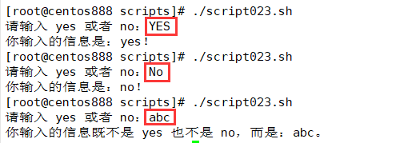

# script023
## 题目

编写脚本 `/root/bin/yesorno.sh`，提示用户输入 `yes` 或 `no`，并判断用户输入的是`yes` 还是 `no`，或是其它信息。


## 分析

本题考查的知识点：

- `read` 命令
- `echo` 命令
- `tr` 命令
- `case...in` 多条件分支条件语句
- `if...elif...else` 多条件分支语句

思路：

- 使用 `read` 命令读取用户从键盘输入的信息。
- 这里使用了 `tr` 命令将大写字母转换成小写字母，避免添加更多条件分支判断。
- 然后使用 `case...in` 语句或 `if...elif...else` 条件语句判断输入的信息等于 `"yes"` 或者 `"no"` 或者其他信息，然后给出对应的提示。


## 脚本一

```shell
#!/bin/bash

####################################
#
# 功能：提示用户输入 yes 或 no，并判断用户输入的是yes 还是 no，或是其它信息。
#
# 使用：没有任何参数，直接调用
#
####################################


# 通过 read 命令提示用户输入
read -p "请输入 yes 或者 no：" input

# 为了避免大小写的问题，将其全部转换成小写处理
input=$(echo "$input" | tr "[A-Z]" "[a-z]")

# 判断用户输入的信息，并给出对应的提示
case "$input" in
"yes")
  echo "你输入的信息是：yes！"
  ;;
"no")
  echo "你输入的信息是：no！"
  ;;
*)
  echo "你输入的信息既不是 yes 也不是 no，而是：$input。"
  ;;
esac
```


## 脚本二

```shell
#!/bin/bash

####################################
#
# 功能：提示用户输入 yes 或 no，并判断用户输入的是yes 还是 no，或是其它信息。
#
# 使用：没有任何参数，直接调用
#
####################################


# 通过 read 命令提示用户输入
read -p "请输入 yes 或者 no：" input

# 为了避免大小写的问题，将其全部转换成小写处理
input=$(echo "$input" | tr "[A-Z]" "[a-z]")

# 判断用户输入的信息，并给出对应的提示
if [ "$input" = "yes" ]; then
    echo "你输入的信息是：yes！"
elif [ "$input" = "no" ]; then
    echo "你输入的信息是：no！"
else
    echo "你输入的信息既不是 yes 也不是 no，而是：$input。"
fi
```


## 测试

执行 `./script023.sh` 调用脚本，然后输入信息将给出对应的提示。



