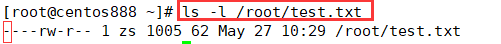
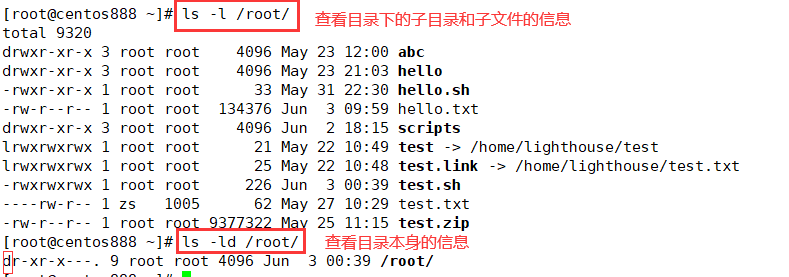
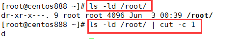
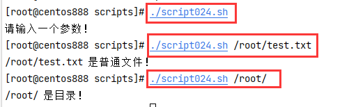

# script024 
## 题目

编写脚本 `/root/bin/filetype.sh`，判断用户输入文件路径，显示其文件类型（普通，目录，链接，其它文件类型)。


## 分析

本题考查的知识点：

- `if` 条件判断语句
- `case` 多分支条件判断语句
- `ls` 命令
- `cut` 命令

思路：

- 如果要判断文件的类型，可以根据 `ls -l` 命令显示的每一行第一个字符来判断。如 `"-"` 表示普通文件；`"d"` 表示目录等。



- 注意，如果是目录那么用 `ls -l` 命令是无法查看目录本身的信息的，而是查看目录下的子目录和子文件的信息。如果要查看目录本身的信息，需要加上 `-d`　选项。



- 获取到表示文件或目录的属性信息后，获取第一个字符可以用 `cut` 命令截取第一个字符。



- 关于文件类型的说明如下表：

| 文件类型符 | 说明         |
| ---------- | ------------ |
| `-`        | 普通文件     |
| `d`        | 目录         |
| `c`        | 字符设备文件 |
| `b`        | 块设备文件   |
| `p`        | 管道文件     |
| `l`        | 链接文件     |
| `s`        | 套接字文件   |

-  关于多条件分支判断语句，既可以用 `case` 语句，也可以用 `if...elif...else` 语句。


## 脚本

```shell
#!/bin/bash

####################################
#
# 功能：判断用户输入文件路径，显示其文件类型（普通，目录，链接，其它文件类型)。
#
# 使用：输入一个有效的文件路径作为第一个参数
#
####################################


# 校验参数个数
if [ $# -ne 1 ]; then
    echo "请输入一个参数！"
    exit
fi
# 校验参数的有效性
file_path="$1"
if [ ! -e "$file_path" ]; then
    echo "不是有效的文件路径：$file_path"
    exit
fi
# 获取文件的类型字符
file_type_char=$(ls -ld "$file_path" | cut -c 1)
# 根据字符判断文件类型
case "$file_type_char" in
"-")
    echo "$file_path 是普通文件！"
    ;;
"d")
    echo "$file_path 是目录！"
    ;;
"c")
    echo "$file_path 是字符设备文件！"
    ;;
"b")
    echo "$file_path 是块设备文件！"
    ;;
"p")
    echo "$file_path 是管道文件！"
    ;;
"l")
    echo "$file_path 是链接文件！"
    ;;
"s")
    echo "$file_path 是套接字文件！"
    ;;
*)
    echo "$file_path 是其他类型文件！"
    ;;
esac
```


## 测试

执行 `./script024.sh filepath` 调用脚本，其中 `filepath` 指的是文件路径。 



