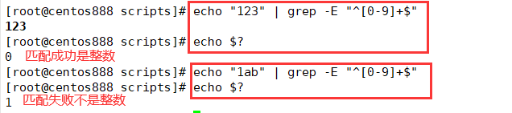

# script025 
## 题目

编写脚本 `/root/bin/checkint.sh`，判断用户输入的参数是否为正整数。


## 分析

本题考查的知识点：

- `read` 命令
- `echo` 命令
- `grep` 命令
- `$?` 变量
- `if` 条件判断语句
- 判断数字大小
- `let` 命令

思路：

- 脚本一：利用 `grep -E` 用表示数字的正则表达式来匹配输入的内容。如果完全匹配则表示输入的是一个整数，否则不是。通过判断 `$?` 是否等于 `0` 来判断是否完全匹配。




- 脚本二：利用条件判断 `[ num -ge 0]`，如果输入的内容是整数大于等于 `0` 则会通过条件判断，如果输入的内容不是整数那么这个条件表达式就不会成立，会报错进入 `else` 语句。注意把错误输出重定向到 `/dev/null` 中。


- 脚本三：利用 `let` 命令对输入的内容与 `0` 进行运算。如果输入的是整数则会正确运算成功，并且返回的状态码是 0；如果输入的不是整数则会运算失败，返回的状态码是非 0。根据这个特性来判断是否是整数。


## 脚本一

```shell
#!/bin/bash

####################################
#
# 功能：判断用户输入的参数是否为正整数。
#
# 使用：输入一个有效的文件路径作为第一个参数
#
####################################


# 获取用户输入的数据
read -p "请输入一个整数：" num

# 校验输入的数据是否是整数
# 使用 grep 的正则表达式匹配来判断，"^[0-9]+$" 完全匹配一个数字
echo "$num" | grep -E "^[0-9]+$"
# 获取上一条命令执行返回的状态码
status_code=$?
# 判断状态码结果，如果状态码为 0 则表示上一条命令执行正确则表示是整数，如果状态码非 0 则表示上一条命令执行不正确则表示非整数
if [ $status_code -eq 0 ]; then
    echo "$num 是一个整数！"
else
    echo "$num 不是一个整数！"
fi
```


## 脚本二

```shell
#!/bin/bash

####################################
#
# 功能：判断用户输入的参数是否为正整数。
#
# 使用：输入一个有效的文件路径作为第一个参数
#
####################################


# 获取用户输入的数据
read -p "请输入一个整数：" num

# 校验输入的数据是否是整数
# 使用错误重定向
if [ "$num" -ge 0 ] &> /dev/null; then
    echo "$num 是一个整数！"
else
    echo "$num 不是一个整数！"
fi
```


## 脚本三

```shell
#!/bin/bash

####################################
#
# 功能：判断用户输入的参数是否为正整数。
#
# 使用：输入一个有效的文件路径作为第一个参数
#
####################################


# 获取用户输入的数据
read -p "请输入一个整数：" num

# 校验输入的数据是否是整数
# 使用 let 命令然后让 num 与 0 求和
let num+0
# 获取上一条命令执行的状态返回码
status_code=$?
# 如果上一条命令正确执行则状态返回码为 0 则表示是整数，如果上一条命令不正确执行则状态反返回码非 0 则表示是非整数
if [ $status_code -eq 0 ]; then
    echo "$num 是一个整数！"
else
    echo "$num 不是一个整数！"
fi
```


## 测试

执行 `./script025.sh` 调用脚本，然后输入内容进行测试判断。


