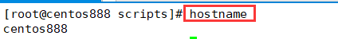
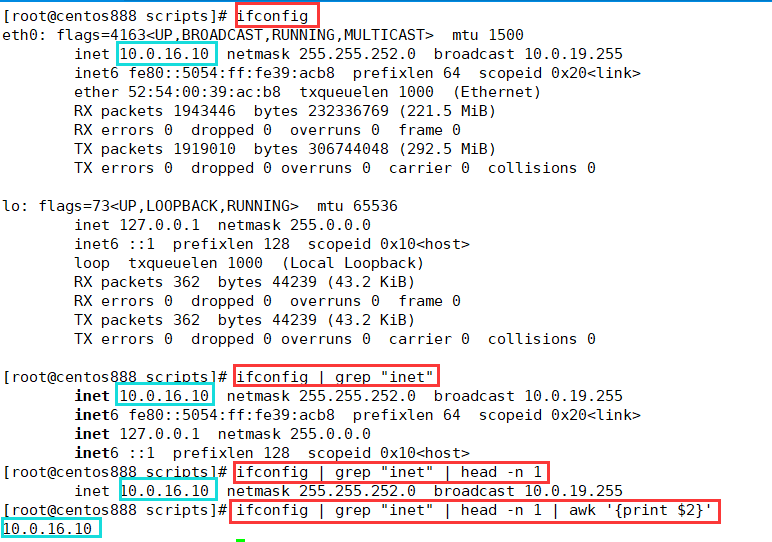
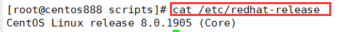
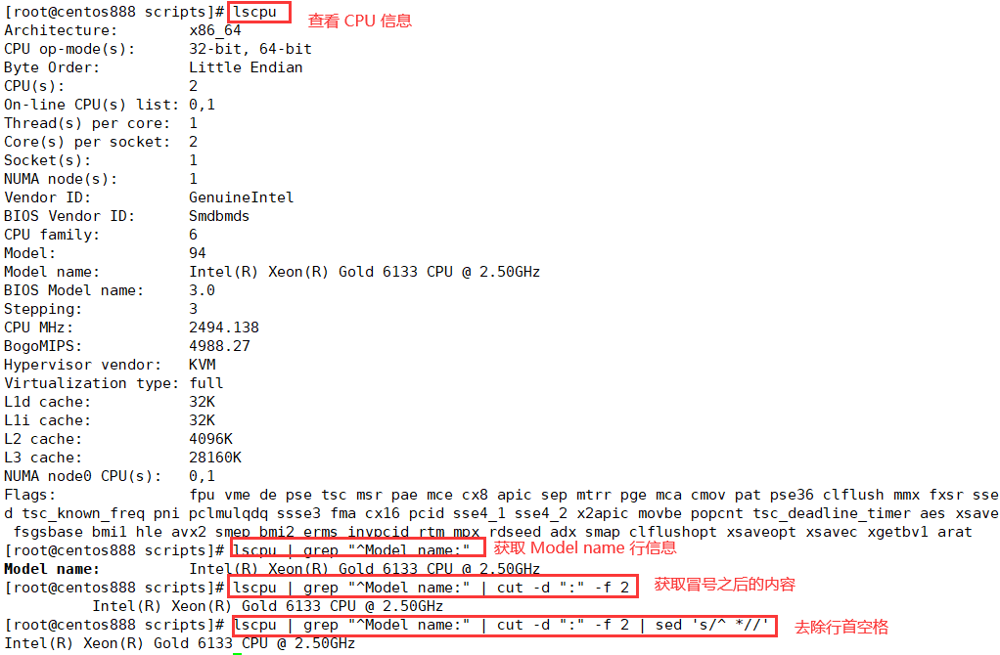
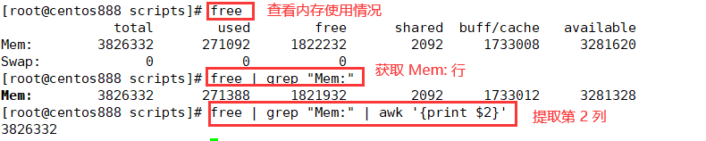
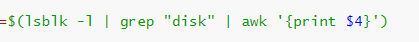
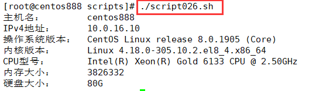

# script026 
## 题目

编写脚本 `/root/bin/systeminfo.sh`，显示当前主机系统信息，包括主机名，IPv4 地址，操作系统版本，内核版本，CPU 型号，内存大小，硬盘大小。


## 分析

本题考查的知识点：

- `hostname` 命令
- `ifconfig` 命令
- `grep` 命令
- `head` 命令
- `awk` 命令
- `uname` 命令
- `lscpu` 命令
- `free` 命令
- `lsblk` 命令
- `cut` 命令
- `sed` 命令

思路：

- `hostname` 命令显示的是就是主机名。



- `ifconfig` 命令显示的就是网络网络信息，但需要提取。



- `/etc/redhat-release` 文件记录了红帽 CentOS 发行版的版本信息。



- `uname` 命令可以查看 Linux 系统内核信息。


- `lscpu` 可以查看 CPU 信息。



- `free` 命令可以查看内存使用情况。



- `lsblk` 命令可以查看硬盘信息。




## 脚本

```shell
#!/bin/bash

####################################
#
# 功能：显示当前主机系统信息，包括主机名，IPv4 地址，操作系统版本，内核版本，CPU 型号，内存大小，硬盘大小。
#
# 使用：不需要任何参数，直接执行
#
####################################


# 获取主机名
hostname=$(hostname)
# 获取 IPv4 地址
ipv4_address=$(ifconfig | grep "inet" | head -n 1 | awk '{print $2}')
# 获取操作系统版本，下面的命令只能获取红帽CentOS发行版的版本信息
os_version=$(cat /etc/redhat-release)
# 获取内核版本
kernel_version=$(uname -sr)
# 获取 CPU 型号
cpu_version=$(lscpu | grep "^Model name:" | cut -d ":" -f 2 | sed 's/^ *//')
# 获取内存大小
memory_size=$(free | grep "Mem:" | awk '{print $2}')
# 获取硬盘大小
hard_disk_size=$(lsblk -l | grep "disk" | awk '{print $4}')

# 打印结果
echo -e "主机名：\t$hostname"
echo -e "IPv4地址：\t$ipv4_address"
echo -e "操作系统版本：\t$os_version"
echo -e "内核版本：\t$kernel_version"
echo -e "CPU型号：\t$cpu_version"
echo -e "内存大小：\t$memory_size"
echo -e "硬盘大小：\t$hard_disk_size"
```


 


## 测试

执行 `./script026.sh` 调用脚本。



