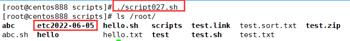

# script027 
## 题目

编写脚本 `/root/bin/backup.sh`，可实现每日将 `/etc/` 目录备份到 `/root/etcYYYY-mm-dd` 中。


## 分析

本题考查的知识点：

- `cp` 命令
- `date` 命令
- 变量

思路：

- 备份就是复制一份原文件到指定目录下，并且对备份文件进行重命名，这里需要用日期进行重命名，所以又需要用到 `date` 命令。


## 脚本

```shell
#!/bin/bash

####################################
#
# 功能：编写脚本 /root/bin/backup.sh，可实现每日将 /etc/ 目录备份到 /root/etcYYYY-mm-dd 中。
#
# 使用：直接调用脚本，不需要任何参数
#
# 作者：lcl100
#
# 日期：2022-06-04
#
####################################


# 变量，指定待备份的目录
DEST_DIR="/etc/"
# 备份目录
cp -R $DEST_DIR "/root/etc$(date +%Y-%m-%d)"
# 如果想要每天自动备份，可以将脚本放入到 /etc/cron.daily/ 目录下
```


## 测试



