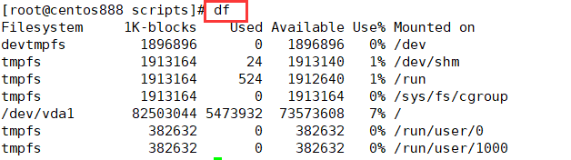
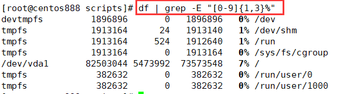
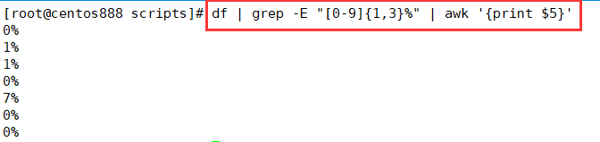
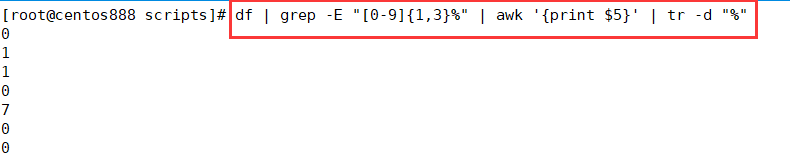
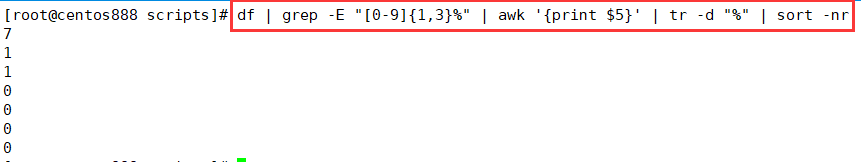
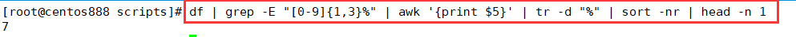
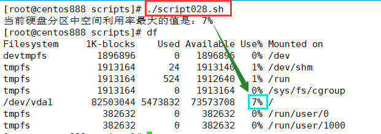

# script028
## 题目

编写脚本 `/root/bin/disk.sh`，显示当前硬盘分区中空间利用率最大的值。


## 分析

本题考查的知识点：

- `df` 命令
- `grep` 命令
- `awk` 命令
- `tr` 命令
- `sort` 命令
- `head` 命令

思路：

> 即找到 `df` 命令显示的磁盘分区空间使用率 `Use%` 中最大的百分比值。

- 使用 `df` 命令查看当前磁盘分区空间的使用情况。




- 使用 `grep` 命令通过正则表达式只检索百分比的数字行，去除首行。




- 使用 `awk` 命令提取第五列内容，即百分比数字列的内容。




- 使用 `tr` 命令删除掉百分号 `%`，为了方便排序。




- 使用 `sort` 命令对使用率进行降序排序。



- 排序后，使用 `head` 命令获取第一行的内容，即最大使用率。





## 脚本

```shell
#!/bin/bash

####################################
#
# 功能：显示当前硬盘分区中空间利用率最大的值。
#
# 使用：不需要任何参数，直接执行
#
####################################


# 获取硬盘分区中空间利用率最大的值
max_disk_usage=$(df | grep -E "[0-9]{1,3}%" | awk '{print $5}' | tr -d "%" | sort -nr | head -n 1)
echo "当前硬盘分区中空间利用率最大的值是：$max_disk_usage%"
```


## 测试

执行 `./script028.sh` 调用脚本。



