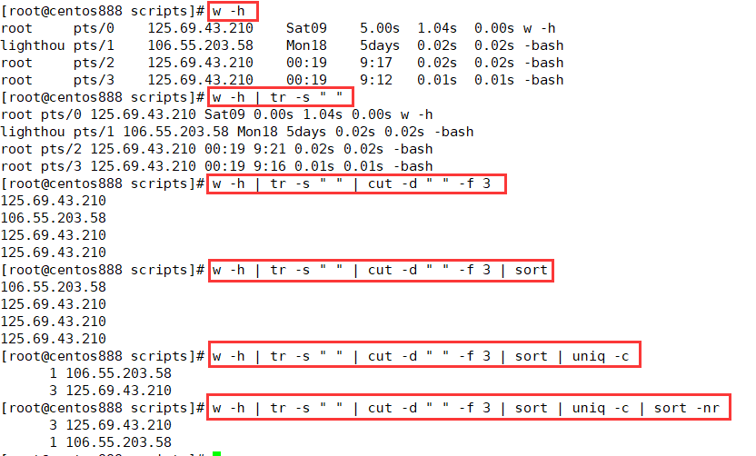

# script029
## 题目

编写脚本 `/root/bin/links.sh`，显示正连接本主机的每个远程主机的 IPv4 地址和连接数，并按连接数从大到小排序。


## 分析

本题考查的知识点：

- `w` 命令
- `tr` 命令
- `cut` 命令
- `sort` 命令
- `uniq` 命令

思路：

- `w -h` 命令显示当前正在登录的用户及它们的 IP 地址。而 `-h` 选项是去除标题行。
- `tr` 命令可以压缩文件行中的空格，只保留一个空格，是为了方便后面的 `cut` 命令提取指定字段。
- `cut` 命令可以截取每行的内容，`-d " "` 表示以空格进行分隔，`-f 3` 然后取第三个字段，即 IP 地址列。
- `sort` 命令对截取的第三列进行排序，让重复行相邻。
- `uniq -c` 命令可以统计每一行的出现次数。
- `sort -nr` 命令对每一行的出现次数进行排序，倒序排列。




## 脚本

```shell
#!/bin/bash

####################################
#
# 功能：编写脚本 /root/bin/links.sh，显示正连接本主机的每个远程主机的 IPv4 地址和连接数，并按连接数从大到小排序。
#
# 使用：直接调用脚本，不需要任何参数
#
# 作者：lcl100
#
# 日期：2022-06-04
#
####################################


w -h | tr -s " " | cut -d " " -f 3 | sort | uniq -c | sort -nr
```


## 测试

执行 `./script029.sh` 调用脚本。


