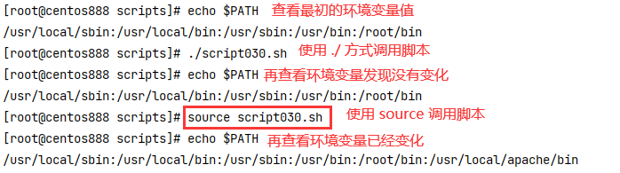

# script030 
## 题目

让所有用户的 `PATH` 环境变量的值多出一个路径，例如: `/usr/local/apache/bin`


## 分析

本题考查的知识点：

- `$PATH` 环境变量
- `export` 命令
- `/etc/profile` 文件

思路：

- 环境变量是保存在 `PATH` 变量中的，可以通过 `echo $PATH` 命令查看环境变量的值。
- 如果要给环境变量添加路径，只需要修改原来的 `PATH` 变量即可，重新给它赋值。环境变量中的路径是通过冒号 `:` 进行分隔的，所以拼接时需要将原环境变量与路径用冒号拼接起来重新赋值。
- 使用 `export` 命令可以提升变量为全局变量。
- 但注意只是临时修改了环境变量只会对本次会话有效，如果要永久生效，需要将 `export` 这句写入到 `/etc/profile` 文件中


> 注：关于环境变量可参考：[在Linux系统中将指定路径添加到环境变量中](https://blog.csdn.net/cnds123321/article/details/121664925)。


## 脚本

```shell
#!/bin/bash

####################################
#
# 功能：让所有用户的 PATH 环境变量的值多出一个路径，例如: /usr/local/apache/bin
#
# 使用：使用 source 命令执行该脚本才会生效，否则修改的环境变量是子 shell 的
#
####################################


# 变量，待添加到环境变量的路径
DEST_PATH="/usr/local/apache/bin"
# 将目标变量与原环境变量进行拼接修改环境变量，中间用分号进行分隔开，然后使用 export 命令提升到全局变量
export PATH="$PATH:$DEST_PATH"
# 只是临时修改了环境变量只会对本次会话有效，如果要永久生效，需要将 export 这句写入到 /etc/profile 文件中
```


## 测试

使用 `source script030.sh` 调用脚本。因为 `./script030.sh` 是在子 shell 中执行，修改的环境变量也是子 shell 的，并不会对当前 shell 的环境变量生效，所以需要使用 `source` 命令来启动，就会修改当前 shell 的环境变量了。



