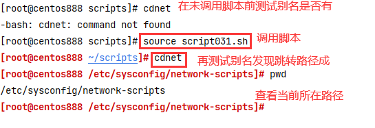

# script031
## 题目

用户 `root` 登录时，将命令指示符变成红色，并自动启用如下别名: 
- `rm= 'rm -i'`
- `cdnet= 'cd /etc/sysconfig/network-scripts/'`
- `editnet= 'vim /etc/sysconfig/network-scripts/ifcfg-ethO'`
- `editnet= 'vim /etc/sysconfig/network-scripts/ifcfg-eno16777736` 或 `ifcfg-eth0`（如果系统是CentOS 7）


## 分析

本题考查的知识点：

- 环境变量 `PS1`
- `/root/.bashrc` 文件
- `alias` 命令
- `source` 命令
- `export` 命令
- `echo` 命令
- `>>` 重定向

思路：

- 本题不需要写一个专门写一个脚本的，上面的要求其实需要将这些修改写入配置文件的。可以直接使用 `vi` 命令打开配置文件进行修改和添加。
- `PS1` 是一个环境变量，存储了 shell 命令行界面的提示符，我们可以通过修改它来修改显示的提示符信息，也可以为其修改显示的颜色，在 Linux 中表示颜色很麻烦。即用颜色标记把原来的 `PS1` 环境变量包起来就会生效。但是只是临时修改，要永久修改需要写入环境变量配置文件中。如果要知道关于 `PS1` 环境变量更多的信息可上网查找相关资料。


- 想要启动时自动启用一些设置的别名，需要将别名设置写入到配置文件中，写入到 `/etc/bashrc` 或者 `~/.bashrc` 文件中都可以，这里是 `root` 用户，所以我们写入到 `/root/.bashrc` 文件中，专门为他配置，而不是应用到所有用户。注意修改后如果不想重启系统让他生效，那么可以执行 `source` 命令让他直接生效。

- 设置别名使用是的 `alias` 命令。


## 脚本

```shell
#!/bin/bash

####################################
#
# 功能：用户 root 登录时，将命令指示符变成红色，并自动启用一些设置的别名
#
# 使用：直接执行，不需要任何参数。需要修改环境变量 PS1，需要使用 source 命令执行才会生效
#
####################################


# 定义一个变量，用来存储 /root/.bashrc 文件的路径
CONFIG_FILE="/root/.bashrc"
# 修改命令提示符的颜色
export PS1='\[\e[1;31m\][\u@\h \W]\$\[\e[0m\] '
# 将下面这些别名添加到 /root/.bashrc 文件中。实际上从一个专门存有别名的文件中读取所有别名再追加到 /root/.bashrc 文件中比较合适
echo "alias rm='rm -i'" >> "$CONFIG_FILE"
echo "alias cdnet='cd /etc/sysconfig/network-scripts/'" >> "$CONFIG_FILE"
echo "alias editnet='vim /etc/sysconfig/network-scripts/ifcfg-eth0'" >> "$CONFIG_FILE"

# 执行 source 命令让配置文件生效
source /root/.bashrc
```


## 测试

执行 `source script031.sh` 调用脚本。



