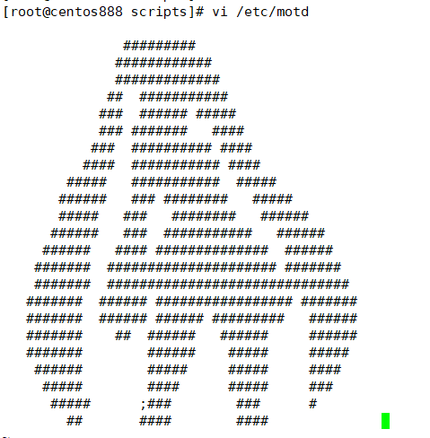
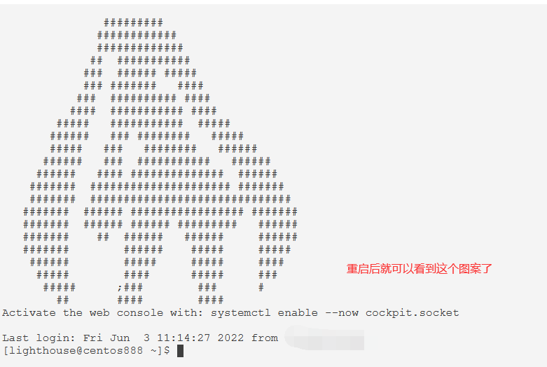
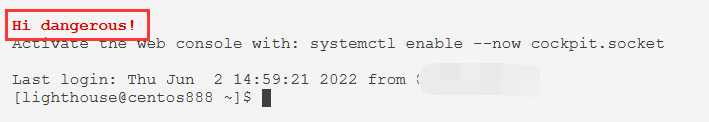

# script032
## 题目

任意用户登录系统时，显示红色字体的警示提醒信息 `Hi, dangerous!`。


## 分析

本题考查的知识点：

- `/etc/motd` 配置文件

思路：

- 每次用户登录时，`/etc/motd` 文件的内容都会显示在用户的终端界面。所以可以修改该文件，来显示一些提示信息，如系统需要进行升级或维护。
- 还可以添加一些有趣的字符图案，只需要将信息写入到 `/etc/motd` 文件即可，实际上也用不到专门写一个脚本。





- 至于如何设置 Linux 字体颜色，可以上网查找相关资料。


## 脚本

```shell
#!/bin/bash

####################################
#
# 功能：任意用户登录系统时，显示红色字体的警示提醒信息 Hi, dangerous!。
#
# 使用：直接执行，不需要任何参数
#
####################################

WELCOME_PATH="/etc/motd"

if [ -f "$WELCOME_PATH" ]; then
    echo -e "\E[1;31mHi dangerous!\E[0m" > /etc/motd
fi
```


## 测试

执行 `./script032.sh` 调用脚本，重启系统后就会看到不同的欢迎提示信息：




