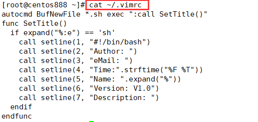
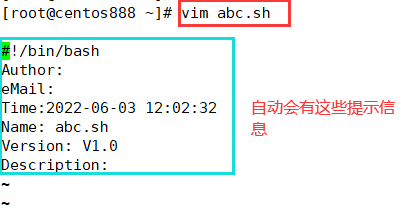

# script033
## 题目

编写生成脚本基本格式的脚本，包括作者，联系方式，版本，时间，描述等。


## 分析

本题考查的知识点：

- `/etc/vimrc` 配置文件
- `EOF`

思路：

- 如果想要每次创建 `.sh` 脚本时，脚本文件中就自动有作者、联系方式等信息，可以修改 `vim` 的配置文件 `/etc/vimrc` 或者 `~/.vimrc`。其中 `~/.vimrc` 对当前用户有效，如果没有这个文件则进行创建；而 `/etc/vimrc` 对所有用户都有效，所以一般不更改它。
- 关于 `vimrc` 文件的内容详细说明可上网查找相关资料。
- 下面使用了 `EOF` 进行多行输入。实际上并不需要通过脚本输入，只需要把配置信息直接赋值粘贴进 `/etc/vimrc` 或者 `~/.vimrc` 文件即可。

实际的配置信息是：

```shell
autocmd BufNewFile *.sh exec ":call SetTitle()"
func SetTitle()
  if expand("%:e") == 'sh'
    call setline(1, "#!/bin/bash")
    call setline(2, "Author: ")
    call setline(3, "eMail: ")
    call setline(4, "Time:".strftime("%F %T"))
    call setline(5, "Name: ".expand("%"))
    call setline(6, "Version: V1.0")
    call setline(7, "Description: ")
  endif
endfunc
```


## 脚本

```shell
#!/bin/bash

####################################
#
# 功能：编写生成脚本基本格式的脚本，包括作者，联系方式，版本，时间，描述等。
#
# 使用：直接执行，不需要任何参数
#
####################################


# 其实就是将下面这段内容输出到 ~/.vimrc 文件中
cat << EOF > ~/.vimrc
autocmd BufNewFile *.sh exec ":call SetTitle()"
func SetTitle()
  if expand("%:e") == 'sh'
    call setline(1, "#!/bin/bash")
    call setline(2, "Author: ")
    call setline(3, "eMail: ")
    call setline(4, "Time:".strftime("%F %T"))
    call setline(5, "Name: ".expand("%"))
    call setline(6, "Version: V1.0")
    call setline(7, "Description: ")
  endif
endfunc
EOF
```


## 测试

调用 `./srcipt033.sh` 脚本后，就已经向 `~/.vimrc` 文件中写入了内容：



以后再使用 `vim` 命令创建 `.sh` 脚本文件时就会自动在文件中添加这 7 行基本信息：




