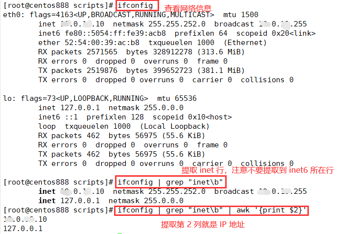
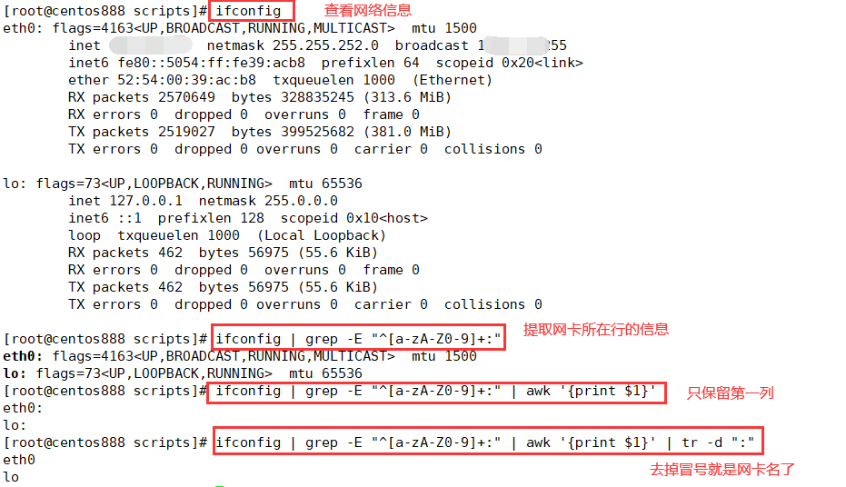
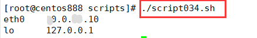

# script034
## 题目

取出网卡 IP 地址。


## 分析

本题考查的知识点：

- `ifconfig` 命令
- `grep` 命令
- `awk` 命令
- `tr` 命令
- `mktemp` 命令
- `paste` 命令
- `echo` 命令

思路：

- 如果是只提取 IP 地址，命令如下：`ifconfig | grep "inet\b" | awk '{print $2}'`。



- 如图，提取网卡名：`ifconfig | grep -E "^[a-zA-Z0-9]+:" | awk '{print $1}' | tr -d ":"`。



- 我想让它们并列显示，网卡名对应 IP 地址。但是 `paste` 命令只能从文件中读取进行合并列，所以通过 `mktemp` 命令创建两个临时文件，将它们放进去，然后使用 `paste` 命令合并它们并显示。


## 脚本

```shell
#!/bin/bash

####################################
#
# 功能：取出网卡 IP 地址。
#
# 使用：直接执行，不需要任何参数
#
####################################


# 获取所有的网卡名字
name=$(ifconfig | grep -E "^[a-zA-Z0-9]+:" | awk '{print $1}' | tr -d ":")
# 获取所有网卡对应的 IP 地址
ipv4_address=$(ifconfig | grep "inet\b" | awk '{print $2}')

# 为了让网卡名字和 IP 地址并列显示，做了如下操作
# 创建一个用来存储所有网卡名字的临时文件，然后将所有的网卡名字写入临时文件
name_temp_file=$(mktemp -t name.XXXXXX)
echo "$name" > "$name_temp_file"
# 创建一个用来存储所有 IP 地址的临时文件，然后将所有的 IP 地址写入临时文件
ipv4_temp_file=$(mktemp -t ipv4.XXXXXX)
echo "$ipv4_address" > "$ipv4_temp_file"
# 使用 paste 命令以列的方式合并两个文件
paste "$name_temp_file" "$ipv4_temp_file"
```


## 测试

执行 `./script034.sh` 调用脚本。



