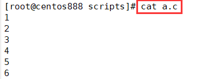
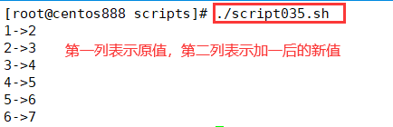

# script035
## 题目

读取 `a.c` 文件中的内容并做加 1 运算。如 `a.c` 内容如下：
```text
1
2
3
4
5
6
```


## 分析

本题考查的知识点：

- `if` 条件判断语句
- `cat` 命令
- `for` 循环语句
- `$(())` 运算

思路：

- 使用 `cat` 命令读取所有行然后使用 `for...in` 循环每一行的内容，用 `$(())` 进行加一运算，最后打印输出。


## 脚本

```shell
#!/bin/bash

####################################
#
# 功能：读取 a.c 文件中的内容并做加 1 运算。如 a.c 内容如下：
#
# 使用：直接执行，不需要任何参数
#
####################################

# 变量，待读取的文件
DEST_FILE="./a.c"

# 判断文件是否存在
if [ ! -f "$DEST_FILE" ]; then
    echo "文件不存在或不是一个普通文件"
fi

# 读取文件所有行
lines=$(cat "$DEST_FILE")
# 循环所有行，对每一行进行操作
for line in $lines ; do
    # 进行加 1 运算
    new_line=$(("$line"+1))
    # 打印原值和新值
    echo "$line->$new_line"
done
```


## 测试

其中 `a.c` 文件的内容如下：



执行 `./script035.sh` 调用脚本：



