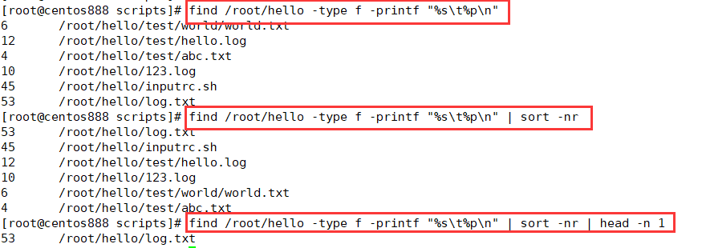
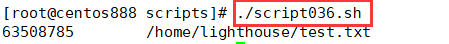

# script036
## 题目

查找指定目录下的最大文件。


## 分析

本题考查的知识点：

- `find` 命令
- `sort` 命令
- `head` 命令

思路：

- 采用 `find` 命令可以查找指定目录下的文件。其中 `-type f` 表示只查找文件；而 `-printf "%s\t%p\n"` 表示只显示文件大小和文件路径。
- `sort -nr` 命令是对上面的 `find` 命令查询出来的文件列表进行排序。`-n` 选项表示按数值进行排序，因为第一列的字段表示文件的大小；`-r` 表示逆序排序，从大到小排序。
- 由于上一步已经把指定目录下的所有文件按照大小进行了排序，所以排序后的第一行就是查找的最大文件。使用 `head -n 1` 命令提取第一行。




## 脚本

```shell
#!/bin/bash

####################################
#
# 功能：查找最大文件。
#
# 使用：直接执行，不需要任何参数
#
####################################


# 变量，指定默认查找目录
DEST_DIR="/home"
# 查找最大的文件
find "$DEST_DIR" -type f -printf "%s\t%p\n" | sort -nr | head -n 1
```


## 测试

执行 `./script036.sh` 调用脚本。



