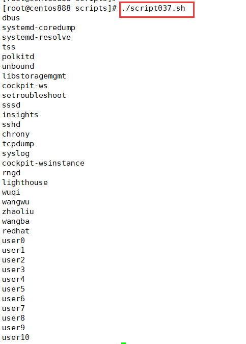

# script038
## 题目

打印无密码用户。


## 分析

本题考查的知识点：

- `cat` 命令
- `/etc/shadow` 配置文件
- `grep` 命令
- `cut` 命令

思路：

- `/etc/shadow` 文件中保存了用户的密码信息。同 `/etc/passwd` 文件一样，文件中每行代表一个用户，同样使用 ":" 作为分隔符，不同之处在于，每行用户信息被划分为 9 个字段。每个字段的含义如下：

```bash
用户名:加密密码:最后一次修改时间:最小修改时间间隔:密码有效期:密码需要变更前的警告天数:密码过期后的宽限时间:账号失效时间:保留字段
```

- 我们判断用户是否有密码的条件就是判断行中是否包含字符串 `"!!"`，如果包含代表这个用户没有密码，不能登录。
- `cat /etc/passwd` 命令查看 `/etc/passwd` 文件的内容；然后通过 `grep` 命令查找包含 `"!!"` 的文件行（即无密码用户）；最后通过 `cut` 命令切割获取第一列的用户名，`-d ":"` 选项表示按照冒号分隔，`-f 1` 表示提取第一列所表示的用户名。


## 脚本

```shell
#!/bin/bash

####################################
#
# 功能：打印无密码用户。
#
# 使用：直接执行，不需要任何参数
#
####################################


cat /etc/shadow | grep "\!\!" | cut -d ":" -f 1
```


## 测试

执行 `./script037.sh` 调用脚本。



