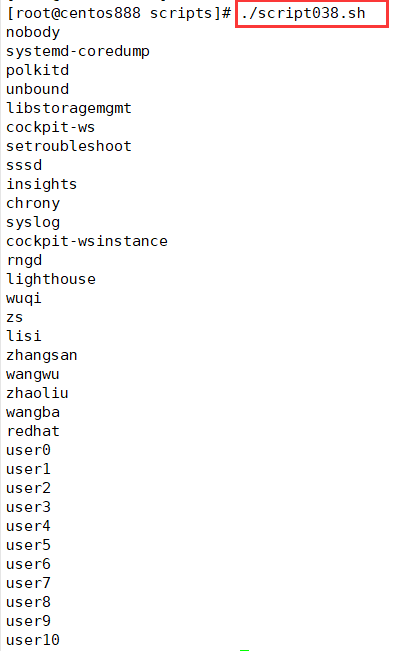

# script038
## 题目

统计一共有多少个普通用户。


## 分析

本题考查的知识点：

- `cat` 命令 
- `/etc/passwd` 文件
- `awk` 命令
- `cut` 命令

思路：

- 在 Linux 系统中用户 ID 大于等于 500 的便是普通用户。
- 使用 `cat` 命令查看 `/etc/passwd` 文件内容；然后通过 `awk` 筛选出第三列（即用户 ID）大于等于 500 的行；最后通过 `cut` 命令筛选出第一列（即用户名），`-d ":"` 表示按冒号分隔，`-f 1` 表示提取第一列。


## 脚本

```shell
#!/bin/bash

####################################
#
# 功能：统计一共有多少个普通用户。
#
# 使用：直接执行，不需要任何参数
#
####################################


cat /etc/passwd | awk -F: '$3>=500' | cut -d ":" -f 1
```


## 测试

执行 `./script038.sh` 调用脚本。



