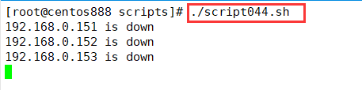

# script044 
## 题目

通过 `ping` 命令测试 `192.168.0.151` 到 `192.168.0.254` 之间的所有主机是否在线：
- 如果在线，就显示 “ip is up”。
- 如果不在线，就显示 “ip is down”。


## 分析

本题考查的知识点：

- `for` 循环语句
- `ping` 命令
- `if...else` 条件判断语句
- `echo` 命令

思路：

- 循环数字 151 到 254，每次循环拼接 IP 地址。
- 通过 `ping` 命令测试拼接的 IP 地址是否能够连通。如果该 IP 地址能够连通则返回状态码为 0，则输出提示信息 `is up`；如果该 IP 地址不能够连通则返回状态码为非 0，则输出提示信息 `is down`。


## 脚本

```shell
#!/bin/bash

####################################
#
# 功能：通过 ping 命令测试 192.168.0.151 到 192.168.0.254 之间的所有主机是否在线：如果在线，就显示 “ip is up”；如果不在线，就显示 “ip is down”。
#
# 使用：直接执行，不需要任何参数
#
####################################


# 循环 151 到 254，拼接 IP 地址
for (( i = 151; i <= 254; i++ )); do
    # 拼接 IP 地址
    ip="192.168.0.$i"
    # 使用 ping 命令测试主机是否可连通
    ping -c 1 $ip &> /dev/null
    # 获取上一条命令执行的返回状态码
    status_code=$?
    # 判断状态码是否等于 0
    if [ $status_code -eq 0 ]; then
        echo "$ip is up"
    else
        echo "$ip is down"
    fi
done
```


## 测试

执行 `./script044.sh` 调用脚本。



