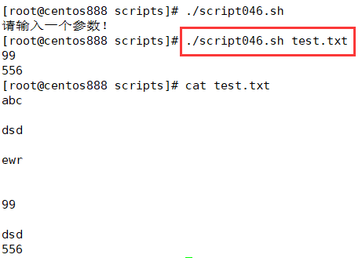

# script046
## 题目

统计文件中仅包含数字的行。


## 分析

本题考查的知识点：

- `if` 条件判断语句
- `echo` 命令
- `exit` 命令
- `egrep` 命令

思路：

- 首先校验参数。
- 使用 `egrep` 命令检索文件中只包含数字的行，利用正则表达式进行匹配。`^[0-9]+$` 表示只匹配全是数字的行。也可以使用 `grep` 命令。


## 脚本

```shell
#!/bin/bash

####################################
#
# 功能：统计文件中仅包含数字的行。
#
# 使用：传入一个有效的文件路径作为第一个参数
#
####################################


# 校验参数个数
if [ $# -ne 1 ]; then
    echo "请输入一个参数！"
    exit
fi

# 校验输入的文件路径是否有效
file_path="$1"
if [ ! -f "$file_path" ]; then
    echo "请输入有效的文件路径！"
    exit
fi

# 查找指定文件中只包含数字的行
egrep "^[0-9]+$" "$file_path"
```


## 测试

执行 `./script046.sh filepath` 调用脚本，其中 `filepath` 表示待统计的文件路径。



