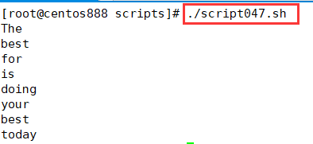

# script047
## 题目

统计英语一句话中字母数不大于6的单词。


## 分析

本题考查的知识点：

- 变量
- `for...in` 循环语句
- `echo` 命令
- `tr` 命令
- `wc` 命令
- `if` 条件判断语句

思路：

- 利用 `for...in` 语句循环存储了英语句子的变量，通过空格自动分割单词。
- 使用 `tr -d "[:punct:]"` 命令删除单词中的标点符号。`echo -n` 会删除换行符。
- `wc -c` 命令可以统计单词中的字母个数。
- 判断单词的字母个数是否不大于 6，如果符合则输出该单词。


## 脚本

```shell
#!/bin/bash

####################################
#
# 功能：统计英语一句话中字母数不大于 6 的单词。
#
# 使用：不需要任何参数，直接调用即可
#
####################################

# 变量，待统计的句子
words="The best preparation for tomorrow is doing your best today."

# 循环句子中的每个单词，以空格进行分隔
for word in $words ; do
    # 删除单词中的标点符号
    word=$(echo -n "$word"  | tr -d "[:punct:]")
    # 计算单词的字母个数
    len=$(echo -n "$word" | wc -c)
    # 比较单词的字母个数是否不大于 6
    if [ $len -le 6 ]; then
        echo "$word"
    fi
done
```


## 测试

执行 `./script047.sh` 调用脚本。



