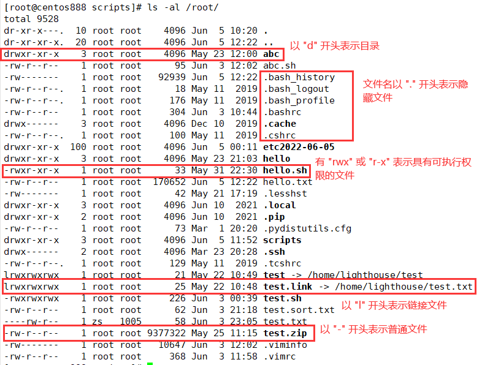
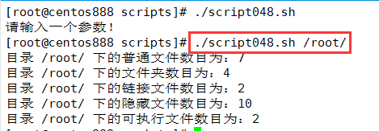

# script048
## 题目

统计某目录下包含的文件数、子文件夹数、链接文件数、隐藏文件数（并显示隐藏的文件名）及可执行文件数。


## 分析

本题考查的知识点：

- `if` 条件判断语句
- `$1` 参数
- `ls` 命令
- `egrep` 命令
- `wc` 命令
- `awk` 命令

思路：

- 首先校验输入的参数。
- 使用 `ls -l` 命令可以查看指定文件或指定目录下所有文件的属性，显示的每一行的第一个字符表示文件的类型属性，如果是 `-` 表示普通文件；如果是 `d` 表示是目录；如果是 `l` 表示是链接文件。
- 使用 `egrep` 命令匹配符合指定正则表达式的文件，如 `"^-"` 表示匹配以 `"-"` 字符开头的行，表示只匹配普通文件。
- 然后使用 `wc` 命令统计上一步通过 `egrep` 命令查找的行数，即文件数目。
- 隐藏文件和可执行文件首先是普通文件，即以 `"-"` 开头的文件。隐藏文件的文件名是以 `"."` 点字符开头的文件，所以先找到所有普通文件，然后筛选出隐藏文件。`awk '{print $9}'` 表示提取第九列（即文件名列），得到了文件名可以用来判断是否是隐藏文件。注意需要 `ls -al` 命令才能查看隐藏文件。
- 可执行文件是 `ls -l` 命令查询出来的文件属性中的文件权限中有 `"x"`，其实要么是 `rwx` 或 `r-x` 都表示有执行权限，所以判断是否匹配到这两个字符串即可。




## 脚本

```shell
#!/bin/bash

####################################
#
# 功能：统计某目录下包含的文件数、子文件夹数、链接文件数、隐藏文件数（并显示隐藏的文件名）及可执行文件数。
#
# 使用：传入指定目录路径作为第一个参数
#
####################################


# 参数校验，校验参数个数
if [ $# -ne 1 ]; then
    echo "请输入一个参数！"
    exit
fi

# 参数校验，校验目录路径是否真实存在
dir_path="$1"
if [ ! -d "$dir_path" ]; then
    echo "请输入有效目录路径！"
    exit
fi

# 统计各类文件的数目
# 普通文件的数目
file_count=$(ls -l "$dir_path" | egrep "^-" | wc -l)
# 文件夹的数目
dir_count=$(ls -l "$dir_path" | egrep "^d" | wc -l)
# 链接文件的数目
link_count=$(ls -l "$dir_path" | egrep "^l" | wc -l)
# 隐藏文件的数目
hide_count=$(ls -al "$dir_path" | egrep "^-" | awk '{print $9}' | egrep "^\." | wc -l)
# 可执行文件的数目
exec_count=$(ls -l "$dir_path" | egrep "^-" | egrep "(rwx|r-x)" | wc -l)

# 打印结果
echo "目录 $dir_path 下的普通文件数目为：$file_count"
echo "目录 $dir_path 下的文件夹数目为：$dir_count"
echo "目录 $dir_path 下的链接文件数目为：$link_count"
echo "目录 $dir_path 下的隐藏文件数目为：$hide_count"
echo "目录 $dir_path 下的可执行文件数目为：$exec_count"
```


## 测试

执行 `./script048.sh dirpath` 调用脚本，其中 `dirpath` 是待统计的目录路径。



