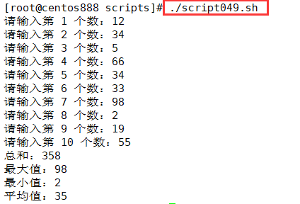

# script049 
## 题目

输入10个数，同时显示和、最大值、最小值和平均数。


## 分析

本题考查的知识点：

- 变量
- `for` 循环语句
- `read` 命令
- `$(())` 运算
- `if...else` 条件判断语句
- 数字比较大小

思路：

- 通过循环语句，每循环一次，便通过 `read` 命令从键盘读取一个数。
- 将这个数计入总和 `sum` 中。如果循环变量 `i` 是第一次则将读入的数 `num` 赋给最大值 `max` 和最小值 `min`；如果循环变量 `i` 不等于 1 则将当前读入的 `num` 与最大值比较谁大，将大者赋给 `max`，将当前读入的 `num` 与最小值比较谁小，将小者赋给 `min`。
- 最后比较完成后，`max` 是最大值，`min` 是最小值，`sum` 是总和，将总和 `sum` 除以 10 就得到平均值 `avg`。 


## 脚本

```shell
#!/bin/bash

####################################
#
# 功能：输入10个数，同时显示和、最大值、最小值和平均数。
#
# 使用：直接调用脚本，然后输入 10 个数
#
####################################


# 变量，分别用来记录总和、最大值、最小值、平均值
sum=0
max=0
min=0
avg=0

# 循环 10 次从键盘输入数据
for (( i = 1; i <= 10; i++ )); do
    # 从键盘输入获取数据
    read -p "请输入第 $i 个数：" num
    # 计入总和
    sum=$(($num+$sum))
    # 比较判断最大值和最小值
    if [ $i -eq 1 ]; then
        max=$num
        min=$num
    else
        # 比较最大值
        if [ $num -gt $max ]; then
            max=$num
        fi
        # 比较最小值
        if [ $num -lt $min ]; then
            min=$num
        fi
    fi
done

# 计算平均值
avg=$(($sum/10))

# 打印结果
echo "总和：$sum"
echo "最大值：$max"
echo "最小值：$min"
echo "平均值：$avg"
```


## 测试

执行 `./script049.sh` 脚本，然后输入 10 个整数。



