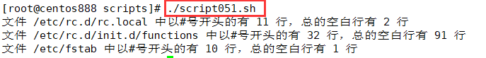

# script051
## 题目

写一个脚本，分别统计 `/etc/rc.d/rc.sysinit`、`/etc/rc.d/init.d/functions` 和 `/etc/fstab` 文件中以 `#` 号开头的行数之和，以及总的空白行数。


## 分析

本题考查的知识点：

- `for...in` 循环语句
- `egrep` 命令
- 正则表达式
- `wc` 命令
- `echo` 命令

思路：

- 将三个文件的文件路径放在一个变量中，以空格进行分隔，然后通过 `for...in` 循环语句进行分隔。
- 使用 `egrep` 命令检索文件中符合指定正则表达式的行，然后用 `wc` 命令统计行数。
- `"^#"` 可以用来匹配以 `"#"` 开头的文件行；`"^$"` 可以用来匹配空白行。


## 脚本

```shell
#!/bin/bash

####################################
#
# 功能：写一个脚本，分别统计 /etc/rc.d/rc.local、/etc/rc.d/init.d/functions 和 /etc/fstab 文件中以 # 号开头的行数之和，以及总的空白行数。
#
# 使用：直接调用脚本，不需要任何参数
#
# 作者：lcl100
#
# 日期：2022-06-04
#
####################################


# 变量，待统计的目标文件
DEST_FILES="/etc/rc.d/rc.local /etc/rc.d/init.d/functions /etc/fstab"

# 循环所有文件，进行统计
for file in $DEST_FILES ; do
    # 以 #　开头的行数
    count=$(egrep "^#" "$file" | wc -l)
    # 空白行数
    blank_count=$(egrep "^$" "$file" | wc -l)
    # 打印结果
    echo "文件 $file 中以#号开头的有 $count 行，总的空白行有 $blank_count 行"
done
```


## 测试

执行 `./script051.sh` 调用脚本。



