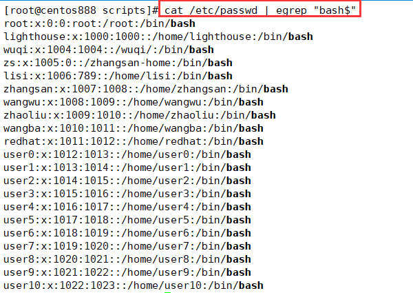
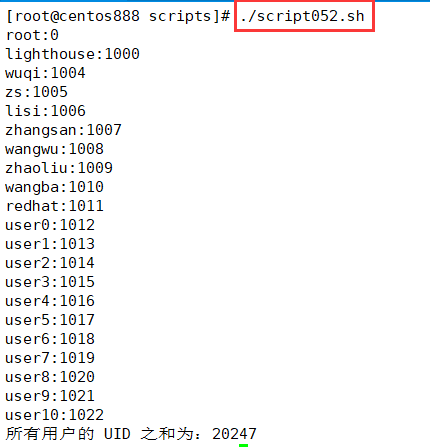

# script052
## 题目

写一个脚本，显示当前系统上所有默认 shell 为 bash 的用户的用户名、UID 以及此类所有用户的 UID 之和。


## 分析

本题考查的知识点：

- `cat` 命令
- `egrep` 命令
- `for...in` 循环语句
- `echo` 命令
- `cut` 命令
- `$(())` 运算

思路：

- 找到 `/etc/passwd` 文件中所有以 `"bash"` 结尾的行，可以通过 `egrep "bash$"` 来检索。



- 找到这些行之后，通过 `for` 语句进行循环。
- 通过 `cut -d ":" -f 1` 提取第一列的内容（即用户名）；通过 `cut -d ":" -f 3` 提取第三列的内容（即用户 ID）。
- 注意使用 `$(())` 把用户ID 计入总和。
- 最后打印结果。


## 脚本

```shell
#!/bin/bash

####################################
#
# 功能：写一个脚本，显示当前系统上所有默认 shell 为 bash 的用户的用户名、UID 以及此类所有用户的 UID 之和。
#
# 使用：直接调用脚本，不需要任何参数
#
# 作者：lcl100
#
# 日期：2022-06-04
#
####################################


# 查找所有默认 shell 为 bash 的用户
bash_users=$(cat /etc/passwd | egrep "bash$")
# 循环遍历所有用户，输出它们的用户名和用户 ID，及计算所有用户的用户 ID 之和
uid_sum=0
for user in $bash_users ; do
    # 获取用户名
    user_name=$(echo "$user" | cut -d ":" -f 1)
    # 获取用户 ID
    user_id=$(echo "$user" | cut -d ":" -f 3)
    # 把用户 ID 计入总和
    uid_sum=$(($uid_sum+$user_id))
    # 打印用户名和用户 ID
    echo "$user_name:$user_id"
done
echo "所有用户的 UID 之和为：$uid_sum"
```


## 测试

执行 `./script052.sh` 调用脚本。



