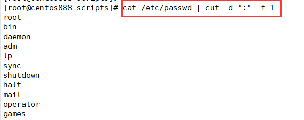
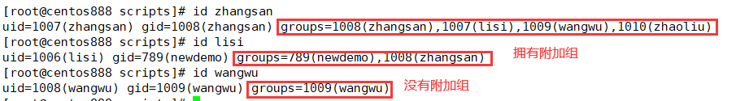
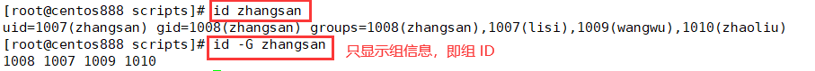
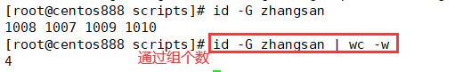
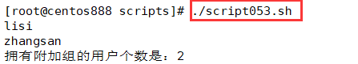

# script053 
## 题目

写一个脚本，显示当前系统上所有，拥有附加组的用户的用户名；并说明共有多少个此类用户。


## 分析

本题考查的知识点：

- `/etc/passwd` 文件
- `cut` 命令
- `for...in` 循环语句
- `id` 命令
- `wc` 命令
- `if` 条件判断语句
- `echo` 命令
- `$(())` 运算

思路：

- 使用 `cat` 命令查看 `/etc/passwd` 文件的所有内容，然后使用 `cut -d ":" -f 1` 提取第一列（即用户名列）。



- 使用 `for...in` 循环语句循环所有的用户名。
- 使用 `id -G` 命令获取当前迭代用户的组信息，多个组 ID 之间通过空格分隔。





- 使用 `wc -w` 命令统计组个数。



- 如果组的个数大于 1 则表示拥有附加组，如果等于 1 则表示没有附加组。


## 脚本

```shell
#!/bin/bash

####################################
#
# 功能：写一个脚本，显示当前系统上所有，拥有附加组的用户的用户名；并说明共有多少个此类用户。
#
# 使用：直接调用脚本，不需要任何参数
#
# 作者：lcl100
#
# 日期：2022-06-04
#
####################################

# 变量，记录附加组的数目
num=0
# 得到 /etc/passwd 文件中的所有用户
users=$(cat /etc/passwd | cut -d ":" -f 1)
# 遍历所有用户
for user in $users ; do
    # 获取用户组的数目
    user_group_count=$(id -G $user | wc -w)
    # 如果用户组的数组大于 1 则表示拥有附加租
    if [ $user_group_count -gt 1 ]; then
        # 打印拥有附加组的用户名
        echo "$user"
        # 计入总数
        num=$(($num+1))
    fi
done
echo "拥有附加组的用户个数是：$num"
```


## 测试

执行 `./script053.sh` 调用脚本。



