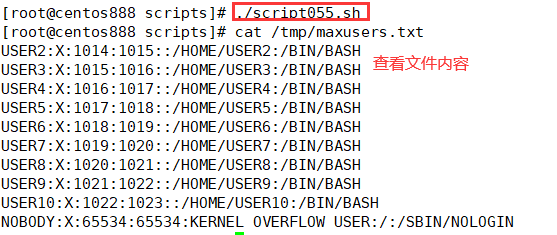

# script054 
## 题目

将 `/etc/passwd/` 中的第三个字段数字最大的后 10 个用户信息全部改为大写后保存至 `/tmp/maxusers.txt`。


## 分析

本题考查的知识点：

- `cat` 命令
- `sort` 命令
- `tail` 命令
- `tr` 命令

思路：

- 使用 `cat` 命令查看 `/etc/passwd` 文件内容。
- 由于 `/etc/passwd` 文件的第三列表示用户 ID，所以使用 `sort` 命令进行排序。其中 `-t ":"` 选项表示按冒号进行分隔；`-k 3` 选项表示按照第三列（即用户 ID 列）进行排序；由于第三列是数字列，所以需要使用 `-n` 选项表示按照数字排序。
- 排序后，是按照升序排列的，所以要获取第三个字段数字最大的后 10 个用户信息，使用 `tail -n 10` 获取最后十行内容。
- 使用 `tr` 命令将所有的小写字母转换成大写字母。
- 最后将内容保存到文件中。


## 脚本

```shell
#!/bin/bash

####################################
#
# 功能：将 /etc/passwd/ 中的第三个字段数字最大的后 10 个用户信息全部改为大写后保存至 /tmp/maxusers.txt。
#
# 使用：直接调用脚本，不需要任何参数
#
# 作者：lcl100
#
# 日期：2022-06-04
#
####################################


# 将 /etc/passwd/ 中的第三个字段数字最大的后 10 个用户信息全部改为大写后保存至 /tmp/maxusers.txt
cat /etc/passwd | sort -t ":" -k 3 -n | tail -n 10 | tr "[a-z]" "[A-Z]" > /tmp/maxusers.txt
```


## 测试

执行 `./script055.sh` 调用脚本。



