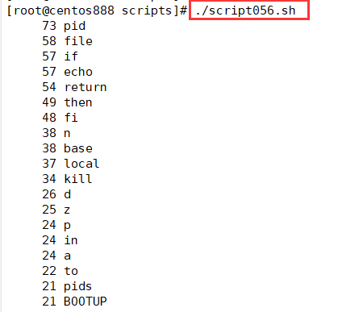

# script056 
## 题目

统计 `/etc/init.d/functions` 文件中每个单词出现的次数，并按频率从高到低显示。


## 分析

本题考查的知识点：

- `egrep` 命令
- `sort` 命令
- `uniq` 命令

思路：

- `egrep -o "[[:alpha:]]+" /etc/init.d/functions` 可以用来检索文件中所有的单词。`-o` 选项表示只显示匹配结果而非整行。


- `sort` 命令可以将所有查询出来的单词进行排序，让重复单词相邻出现。


- `uniq -c` 命令可以用来统计所有单词的出现次数。


- `sort -nr` 对所有单词按照出现次数进行排序。`-n` 表示按照数字排序；`-r` 表示逆序排序，从高到低。


## 脚本

```shell
#!/bin/bash

####################################
#
# 功能：统计 /etc/init.d/functions 文件中每个单词出现的次数，并按频率从高到低显示。
#
# 使用：直接调用脚本，不需要任何参数
#
# 作者：lcl100
#
# 日期：2022-06-04
#
####################################


egrep -o "[[:alpha:]]+" /etc/init.d/functions | sort | uniq -c | sort -nr
```


## 测试

执行 `./script056.sh` 调用脚本。



