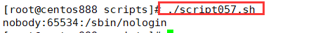

# script057
## 题目

查出用户 UID 最大值的用户名、 UID 及 shell 类型。


## 分析

本题考查的知识点：

- `sort` 命令
- `tail` 命令
- `cut` 命令

思路：

- 我们要找到 UID 最大的用户，需要先按照 UID 进行排序，然后取出最后一行就是 UID 最大的一行，最后提取用户名、 UID 及 shell 类型。
- `sort` 命令可以对用户 UID 进行排序，其中 `-t ":"` 表示按照冒号分隔；`-k 3` 表示按照第三列（即用户 ID 列）进行排序；`-n` 表示按照数字排序，因为 UID 是数字，需要加上该选项才会正确按数字排序，否则还是按照 ASCII 码顺序排序。
- 使用 `tail` 命令取出排序后的最后一行。
- 使用 `cut` 命令提取第一、三、七列，分别表示用户名、 UID 及 shell 类型。


## 脚本

```shell
#!/bin/bash

####################################
#
# 功能：查出用户 UID 最大值的用户名、 UID 及 shell 类型。
#
# 使用：直接调用脚本，不需要任何参数
#
# 作者：lcl100
#
# 日期：2022-06-04
#
####################################


sort -t ":" -k 3 -n /etc/passwd | tail -n 1 | cut -d ":" -f 1,3,7
```


## 测试

执行 `./script057.sh` 调用脚本。



