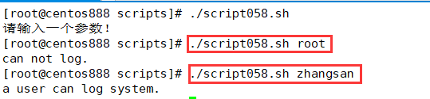

# script058
## 题目

写一个脚本，传递一个用户名参数给脚本：如果用户的 id 号大于等于 500，且其默认 shell 为以 sh 结尾的字符串，则显示 “a user can log system.” 类的字符串；否则，则显示无法登录系统。


## 分析

本题考查的知识点：

- `if...else` 条件语句
- `echo` 命令
- `id` 命令
- `egrep` 命令
- `cut` 命令

思路：

- 获取输入的参数作为用户名，注意校验参数个数。
- 同时注意使用 `id` 命令校验用户名是否存在于系统中，如果不存在则退出。
- 再接着就是利用正则表达式取匹配 `/etc/passwd` 文件中是否有该用户并且 Shell 以 `"sh"` 结尾。这里使用 `egrep` 命令进行检索。


- 如果找到则该用户所在行则使用 `cut` 命令提取用户 ID。


- 最后判断用户 ID 是否大于等于 500，输出对应的提示信息。


## 脚本

```shell
#!/bin/bash

####################################
#
# 功能：写一个脚本，传递一个用户名参数给脚本：如果用户的 id 号大于等于 500，且其默认 shell 为以 sh 结尾的字符串，则显示 “a user can log system.” 类的字符串；否则，则显示无法登录系统。
#
# 使用：直接调用脚本，不需要任何参数
#
# 作者：lcl100
#
# 日期：2022-06-04
#
####################################


# 参数校验，校验参数个数
if [ $# -ne 1 ]; then
    echo "请输入一个参数！"
    exit
fi

# 获取用户输入的用户名
username="$1"
# 应该判断用户是否存在，如果不存在则退出
id $username &> /dev/null
if [ $? -ne 0 ]; then
    echo "该用户不存在！"
    exit
fi

# 在 /etc/passwd 中文件查找该用户的用户 ID，避免正则表达式匹配多行
user_id=$(egrep "^${username}:.*sh$" /etc/passwd | cut -d ":" -f 3)

# 判断用户 ID 大于等于 500
if [ $user_id -ge 500 ]; then
    echo "a user can log system."
else
    echo "can not log."
fi
```


## 测试

执行 `./script058.sh` 调用脚本。



