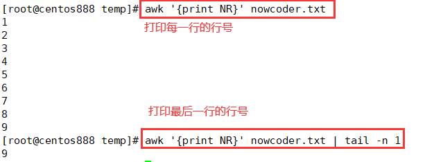
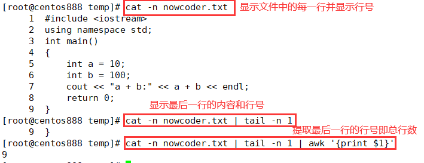

# script059
## 题目

> 注：题目来源于 [SHELL1 统计文件的行数](https://www.nowcoder.com/practice/205ccba30b264ae697a78f425f276779?tpId=195&tqId=36211&rp=1&ru=/exam/oj&qru=/exam/oj&sourceUrl=%2Fexam%2Foj%3Fpage%3D1%26tab%3DSHELL%25E7%25AF%2587%26topicId%3D195&difficulty=undefined&judgeStatus=undefined&tags=&title=)。

写一个 `bash` 脚本以输出一个文本文件 `nowcoder.txt` 中的行数。

示例，假设 `nowcoder.txt` 内容如下：
```c
#include <iostream>
using namespace std;
int main()
{
    int a = 10;
    int b = 100;
    cout << "a + b:" << a + b << endl;
    return 0;
}
```
那么你的脚本应当输出：
```text
9
```


## 脚本一

使用 `wc` 命令的 `-l` 选项统计行数，结果只会显示行数：

```shell
cat nowcoder.txt | wc -l
```


## 脚本二

其中 `wc -l nowcoder.txt` 会显示文件的总行数和文件名，所以需要使用 `awk` 命令提取第一个字段域，即总行数。


```shell
wc -l nowcoder.txt | awk '{print $1}'
```


## 脚本三

循环读取文件 `nowcoder.txt` 中的每一行，然后用一个计数变量 `count` 来统计总行数，最后输出总行数。没遍历一行，计数器就加一。

```bash
#!/bin/bash

count=0

while read line; do
  count=$((${count}+1))
done < nowcoder.txt

echo "${count}"
```


## 脚本四

`grep` 命令的 `-c` 选项可以统计匹配到的行数。而 `grep ".*"` 表示匹配任何行，因为 `.` 表示任意字符，`*` 表示前面的任意字符出现零次或者任意次，所以可以匹配到所有的文本行，因此再用 `-c` 选项统计匹配行数。

```shell
 cat nowcoder.txt | grep ".*" -c
```


## 脚本五

使用 `awk` 命令编程来统计文件 `nowcoder.txt` 的总行数，其中 `BEGIN{}` 中声明一个计数器变量 `count` 用来记录总行数；而 `{}` 中每遍历一行，则计数器变量 `count` 就加一；最后的 `END{}` 是当遍历完所有行及进行相关操作后就打印计数器变量 `count` 即总行数。

```shell
awk 'BEGIN{count=0} {count=count+1} END{print count}' nowcoder.txt 
```


## 脚本六

`awk` 中的 `NR` 是内置变量表示行号，`awk '{print NR}' nowcoder.txt` 就会显示每行的行号，而 `tail -n 1` 表示获取最后一行的行号，即总行数。



```shell
awk '{print NR}' nowcoder.txt | tail -n 1
```


## 脚本七

`cat` 命令使用 `-n` 选项也可以显示文件的行号，但同时也会打印该行的内容；使用 `tail -n 1` 获取最后一行的行号和内容；再用 `awk` 命令提取最后一行显示的行号。



```shell
cat -n nowcoder.txt | tail -n 1 | awk '{print $1}'
```


## 脚本八

`sed -n '$='` 命令也可以显示文件的总行数。

```shell
sed -n '$=' nowcoder.txt 
```


## 脚本九

`nl` 命令同 `cat -n` 一样，都可以显示文件的行号和内容。

```shell
nl nowcoder.txt | tail -n 1 | awk '{print $1}'
```

> 注：但未通过该网站的测试用例。


## 脚本十

可以直接在 `awk` 命令的 `END{}` 中打印内置变量 `NR` 就会输出文件的总行数。

```shell
awk 'END{print NR}' nowcoder.txt
```
