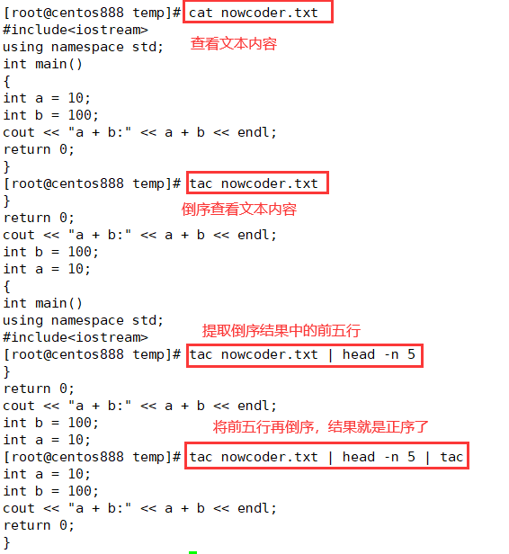

# script060
## 题目

经常查看日志的时候，会从文件的末尾往前查看，于是请你写一个 bash 脚本以输出一个文本文件 `nowcoder.txt` 中的最后 `5` 行。

示例，假设 `nowcoder.txt` 内容如下：

```c
#include<iostream>
using namespace std;
int main()
{
int a = 10;
int b = 100;
cout << "a + b:" << a + b << endl;
return 0;
}
```

你的脚本应当输出：

```c
int a = 10;
int b = 100;
cout << "a + b:" << a + b << endl;
return 0;
}
```


## 脚本一

直接使用 `tail` 命令的 `-n` 选项就可以查看文件的最后 5 行内容。

```shell
tail -n 5 nowcoder.txt
```


## 脚本二

使用 `awk` 来编程求解。其中 `BEGIN{}` 中声明一个变量 `x` 来记录行数；`{}` 中将每一行内容存放到数组 `arr` 中，并且变量 `x` 加一；最后在 `END{}` 语句中遍历数组 `arr` 最后五行打印输出。

```shell
awk 'BEGIN{x=1} {arr[x]=$0;x++} END{for(i=NR-4;i<=NR;i++) print arr[i]}' nowcoder.txt
```


## 脚本三

`sed` 命令也可以打印指定范围的行，其中 `'5,$p'` 表示显示第 5 行到最后一行的内容。

```shell
sed -n '5,$p' nowcoder.txt
```

> 注：如果只是上面提供的示例文本，那么这个命令可以得到正确的结果，但如果换了其他文本，那么可能就不会得到正确的结果了。因为 `'5,$p'` 表示从第五行开始，如果文件只有六行，那么只会显示两行。所以该命令无效。


## 脚本四

```shell
awk 'NR>=5{print $0}' nowcoder.txt
```

> 注：跟脚本三的理由一样。该命令无效。


## 脚本五

`tac` 命令可以将文本行倒序显示，然后使用 `head` 命令获取前五行，再使用 `tac` 命令将原本倒序行再倒序就变成了正序结果了。



```shell
tac nowcoder.txt | head -n 5 | tac
```