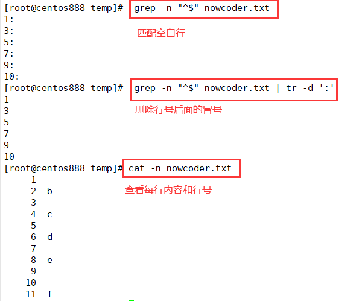

# script063
## 题目

写一个 bash 脚本以输出一个文本文件 `nowcoder.txt` 中空行的行号，可能连续，从1开始。

示例，假设 nowcoder.txt 内容如下：
```text
a
b

c

d

e


f
```

你的脚本应当输出：
```text
3
5
7
9
10
```


## 脚本一

使用 `grep -n` 命令就可以显示文件匹配到内容的行号，而 `grep` 命令可以通过正则表达式来匹配。`"^$"` 在正则表达式中就表示匹配空行。找到空行后由于结果中会显示一个冒号，所以需要通过 `tr` 命令的 `-d` 选项删除冒号。



```shell
 grep -n "^$" nowcoder.txt | tr -d ':'
```


## 脚本二

使用 `awk` 命令的内置函数 `length()` 可以判断该行的长度，如果长度为零则表示是空行，则打印该行的行号，内置变量 `NR` 表示行号。

```shell
 awk '{if(length($0)==0) print NR}' nowcoder.txt
```


## 脚本三

`awk` 命令也支持正则表达式匹配，也可以使用 `^$` 匹配空行然后输出行号。

```shell
awk '/^$/ {print NR}' nowcoder.txt
```


## 脚本四

还可以通过下面的方式判断空白行，`NF` 表示每行的列个数，如果为零则表示是空行则输出该行行号。

```shell
awk 'NF==0{print NR}' nowcoder.txt
```


## 脚本五

还可以通过读取文件每行内容，通过 `-z` 判断文件行所表示的字符串是否是空字符串，如果是则表示该行是空行，则输出该行行号，而行号是由一个自定义的变量来记录的，每遍历一行，则该变量加一。

```shell
#!/bin/bash

i=0
while read line; do
  i=$((${i}+1))
  if [ -z "${line}" ]; then
      echo "${i}"
  fi
done < nowcoder.txt
```