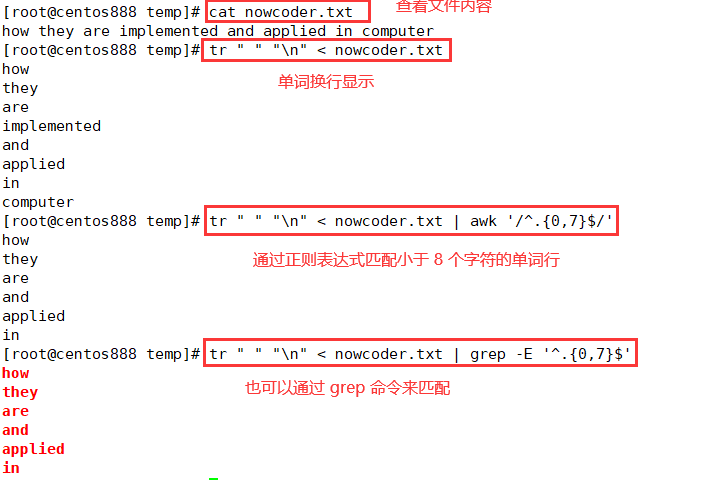

# script065
## 题目

> 题目来源于 [SHELL7 打印字母数小于8的单词 ](https://www.nowcoder.com/practice/bd5b5d4b93a04226a81afbabf0be797d?tpId=195&tags=&title=&difficulty=0&judgeStatus=0&rp=1&sourceUrl=%2Fexam%2Foj%3Fpage%3D1%26tab%3DSHELL%25E7%25AF%2587%26topicId%3D195)。

写一个 bash脚本以统计一个文本文件 `nowcoder.txt` 中字母数小于 `8` 的单词。

示例，假设 nowcoder.txt 内容如下：
```text
how they are implemented and applied in computer
```

你的脚本应当输出：
```text
how
they
are
and
applied
in
```

> 说明：不要担心你输出的空格以及换行的问题


## 脚本一

使用 `tr` 命令将文本中的单词单独换行显示（即每行显示一个单词），即将空格字符替换成换行符；然后用 `awk` 命令的 `length` 函数判断该行单词的长度是否小于 8，如果小于则输出该行的单词。

```shell
cat nowcoder.txt | tr -s ' ' '\n' | awk '{if(length($0)<8) print $0}'
```


## 脚本二

循环遍历文本中的每个单词；通过变量扩展 `${#var}` 获取变量的字符个数，再通过 `if` 判断语句比较字符个数是否小于 8，如果是则进行输出。

```shell
#!/bin/bash


FILE="nowcoder.txt"

words=$(cat "${FILE}" | tr -s ' ' '\n')
for word in ${words} ; do
    if [ ${#word} -lt 8 ]; then
        echo "${word}"
    fi
done
```


## 脚本三

使用 `tr` 命令将文本内容中的单词单行显示；然后使用 `awk` 命令通过正则表达式匹配小于等于 7 个字符的行，其中 `^.{0,7}$` 表示匹配以任意字符开头和结尾的字符串，但字符个数必须在 0 个和 7 个之间，包括本身。



```shell
tr " " "\n" < nowcoder.txt | awk '/^.{0,7}$/'
```

