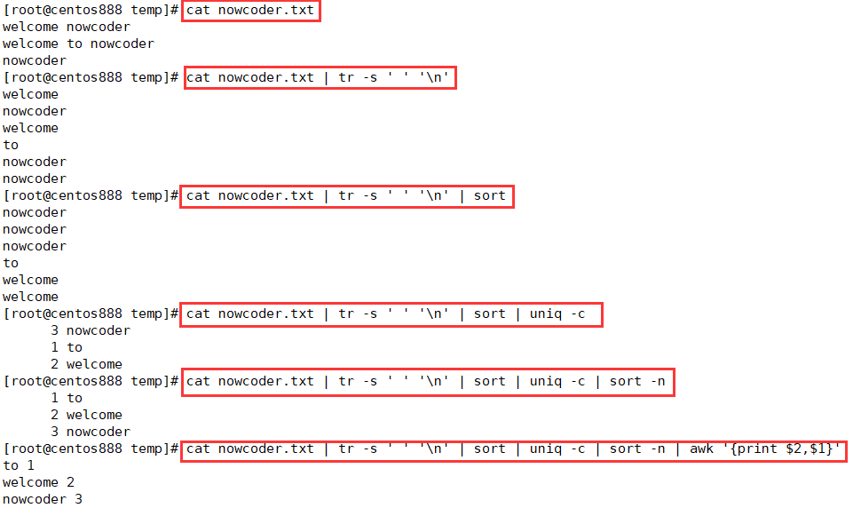

# script067
## 题目

> 题目来源于 [SHELL9 统计每个单词出现的个数 ](https://www.nowcoder.com/practice/ad921ccc0ba041ea93e9fb40bb0f2786?tpId=195&tags=&title=&difficulty=0&judgeStatus=0&rp=1&sourceUrl=%2Fexam%2Foj%3Fpage%3D1%26tab%3DSHELL%25E7%25AF%2587%26topicId%3D195)。

写一个 bash脚本以统计一个文本文件 `nowcoder.txt` 中每个单词出现的个数。

为了简单起见，你可以假设：
- `nowcoder.txt` 只包括小写字母和空格。
- 每个单词只由小写字母组成。
- 单词间由一个或多个空格字符分隔。

示例，假设 nowcoder.txt 内容如下：
```text
welcome nowcoder
welcome to nowcoder
nowcoder
```

你的脚本应当输出（以词频升序排列）：
```text
to 1
welcome 2
nowcoder 3
```

> 说明：不要担心个数相同的单词的排序问题，每个单词出现的个数都是唯一的。


## 脚本一

通过 `tr` 命令将文件中所有的单词单独一行显示，即将空格分隔的单词使用换行符替换；然后通过 `sort` 命令将所有相同的单词相邻排序显示；再使用 `uniq -c` 命令统计每个单词的出现次数；由于要求按词频升序排列，所以需要通过 `sort -n` 进行数字排序；由于 `uniq` 命令显示是词频在前，单词在后，所以需要通过 `awk` 命令将单词显示在前，词频显示在后。



```shell
cat nowcoder.txt | tr -s ' ' '\n' | sort | uniq -c | sort -n | awk '{print $2,$1}'
```


## 脚本二

通过 `awk` 编程实现，原理是将每个单词存储到关联数组中，键是单词，键值是该单词的出现次数。在 `{}` 中将文本中所有单词的出现次数存放到关联数组中；再通过 `END{}` 循环遍历关联数组，输出每个单词的出现次数；最后通过 `sort -n -k 2` 将 `awk` 命令的输出结果按词频升序排列。

```shell
awk '{
  for(i=1;i<=NF;i++)
    map[$i]++;
}
END{
  for(key in map)
    printf("%s %d\n", key, map[key]);
}' nowcoder.txt | sort -n -k 2
```