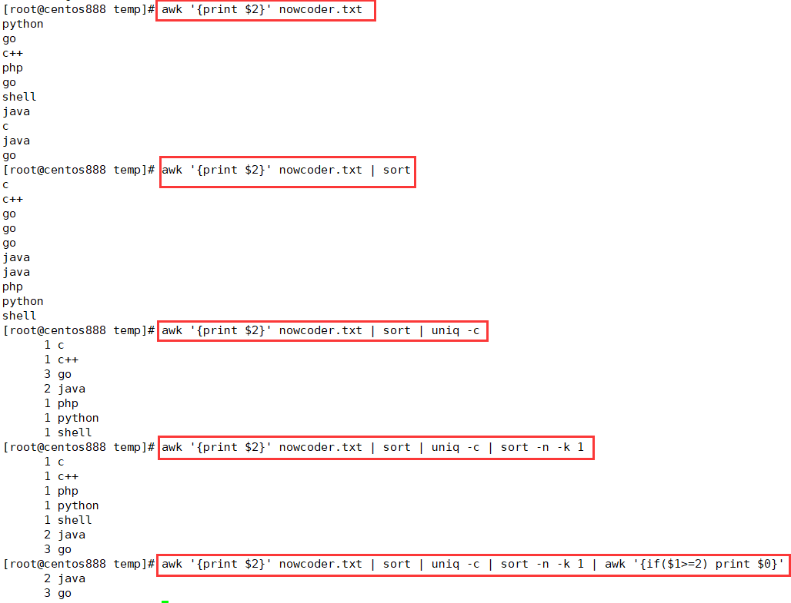

# script068
## 题目

> 注：题目来源于 [SHELL10 第二列是否有重复 ](https://www.nowcoder.com/practice/61b79ffe88964c7ab7b98ae16dd76492?tpId=195&tags=&title=&difficulty=0&judgeStatus=0&rp=1&sourceUrl=%2Fexam%2Foj%3Fpage%3D1%26tab%3DSHELL%25E7%25AF%2587%26topicId%3D195)。

给定一个 `nowcoder.txt` 文件，其中有 `3` 列信息，如下实例，编写一个 shell 脚本来检查文件第二列是否有重复，且有几个重复，并提取出重复的行的第二列信息。实例：
```text
20201001 python 99
20201002 go 80
20201002 c++ 88
20201003 php 77
20201001 go 88
20201005 shell 89
20201006 java 70
20201008 c 100
20201007 java 88
20201006 go 97
```

结果：
```text
2 java
3 go
```


## 脚本一

思路就是提取文本中的第二列内容，然后对其进行排序去重，统计每个去重后单词的出现次数，最后筛选出出现次数大于等于 2 的单词。

`cat nowcoder.txt | sort -k 2 | awk '{print $2}'` 表示提取文件中的第二列并排序；`uniq -c` 表示对第二列进行去重并统计每行单词的出现次数；`awk '{if($1>=2) print $0}'` 表示筛选出出现次数大于等于 2 的行；`sort -nr -k 1` 表示安装词频升序排列；`sed 's/^[ \t]*//g'` 表示去除行首的空格。

```shell
cat nowcoder.txt | sort -k 2 | awk '{print $2}' | uniq -c | awk '{if($1>=2) print $0}' | sort -nr -k 1 | sed 's/^[ \t]*//g'
```


## 脚本二

同脚本一基本一致。



```shell
awk '{print $2}' nowcoder.txt | sort | uniq -c | sort -n -k 1 | awk '{if($1>=2) print $0}' | sed 's/^[ \t]*//g'
```


## 脚本三

将文件中每一行第二列的单词存储到关联数组中，键名是单词，键值是该单词的出现次数，这步操作在 `{}` 中完成；接着在 `END{}` 中通过循环遍历关联数组中，筛选出单词出现次数大于 2 的词汇，并打印它们的出现次数和词汇。

```shell
awk '{map[$2]++} END{for(k in map) if(map[k]>=2) printf("%d %s\n", map[k], k)}' nowcoder.txt
```