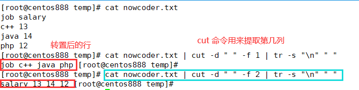

# script069
## 题目

写一个 bash 脚本来转置文本文件 `nowcoder.txt` 中的文件内容。

为了简单起见，你可以假设：
- 你可以假设每行列数相同，并且每个字段由空格分隔。

示例，假设 `nowcoder.txt` 内容如下：
```text
job salary
c++ 13
java 14
php 12
```

你的脚本应当输出（以词频升序排列）：
```text
job c++ java php
salary 13 14 12
```


## 脚本一

`awk` 命令在 `{}` 中将每一列的单词连接成以空格进行分隔的字符串存放在数组中，其中数组下标就是列号（也就是转置后的行号）；在 `END{}` 中将数组中的每一项进行输出。

```shell
awk '{
    for (i = 1; i <= NF; i++){
        if (NR == 1) {
            array[i] = $i
        } else {
            array[i] = array[i]" "$i
        }
    }
} END {
    for(j = 1; j <= NF; j++){
        print array[j]
    }
}' nowcoder.txt
```


## 脚本二

文本的列数就是转置后的行数，所以必须获取到，通过 `awk` 命令就能得到，然后遍历每一列，将每一列的内容转换成一行，即将换行符替换成空格，那么多列也就变成了一行，这通过 `tr` 命令完成。有几列就输出几行。



```shell
#!/bin/bash

# 获取文件的列数
column_count=$(awk 'END{print NF}' nowcoder.txt)

for i in $(seq ${column_count}); do 
  line=$(cat nowcoder.txt | cut -d " " -f ${i} | tr -s "\n" " ")
  echo ${line}
done 
```