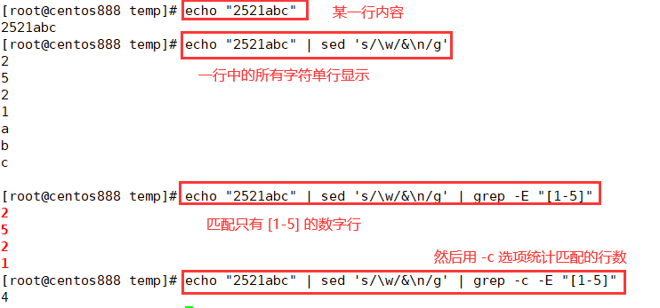

# script070
## 题目

> 注：题目来源于 [SHELL12 打印每一行出现的数字个数 ](https://www.nowcoder.com/practice/2d2a124f98054292aef71b453e705ca9?tpId=195&tags=&title=&difficulty=0&judgeStatus=0&rp=1&sourceUrl=%2Fexam%2Foj%3Fpage%3D1%26tab%3DSHELL%25E7%25AF%2587%26topicId%3D195)。

写一个 bash 脚本以统计一个文本文件 `nowcoder.txt` 中每一行出现的 `1,2,3,4,5` 数字个数并且要计算一下整个文档中一共出现了几个 `1,2,3,4,5`  数字的数字总数。

示例，假设 `nowcoder.txt` 内容如下：
```text
a12b8
10ccc
2521abc
9asf
```

你的脚本应当输出：
```text
line1 number: 2
line2 number: 1
line3 number: 4
line4 number: 0
sum is 7
```

- 说明：不要担心你输出的空格以及换行的问题


## 脚本一

即读取文件中的每一行内容，然后将每行的每一个字符单独一行显示，然后用 `grep -c` 命令检索出现了数字是 `[1-5]` 的行数，即为结果。



```shell
#!/bin/bash

# 可以将一个字符串中的每个字符单独换行输出
# printf "hello" | sed 's/\w/&\n/g'

# 计数器变量，统计每行出现数字在 [1-5] 的数字的总个数
count=0
# 行号变量，记录当前行的行号
line_number=0
# 循环读取每一行
while read line; do
    # 行号加一
    line_number=$(($line_number+1))
    # 计算当前行中出现数字在 [1-5] 的数字的个数
    num=$(printf "${line}" | sed 's/\w/&\n/g' | grep -c -E "[1-5]")
    # 打印每行个数
    echo "line${line_number} number: ${num}"
    # 将每行个数添加到总个数中
    count=$(($num+$count))
done < nowcoder.txt
# 打印最终总个数
echo "sum is ${count}"
```


## 脚本二

`awk` 命令的 `gsub()` 函数会返回替换的次数，所以替换了几个数字（正则表达式 `[1-5]` 匹配的数字）就返回几，就表示该行的数字个数。

```shell
#!/bin/bash

awk '{
  num=gsub(/[1-5]/,"");
  sum+=num;
  printf("line%d number: %d\n", NR, num);
}
END{
  printf("sum is %d\n", sum);
}' nowcoder.txt
```